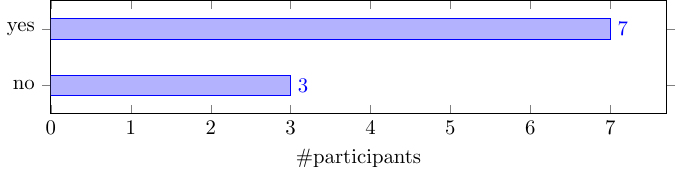

## NEWS
* Output files like .png and .pdf are now being stored in `./out`
* The `README.Rmd` document now allows to customize variables for the folders
* The Hugo website through the `_build_site.R` script also allow some customization
* The source folder with TikZ files are now only saved in `src`. Only `tex` files
* The template file `template.Rmd` includes now special identifiers so it can be updated with user custom settings that `child.Rmd` uses to retrieve all graphics and code for each of the examples
* The `Makefile` has been optimized to avoid code repetition
* All data files for the TikZ examples now live under `src/data`

## Introduction
This is a repository of the best TikZ examples I have found around the web and from papers, slides, tutorials, and books. Most of the examples are simple enough to encourage anyone to start learning TikZ. By having the result (graphic) on a web page, and be able to click on it to see the code, it rapidly helps to make the connection between **code** and **output**. I find this idea fantastic.

TikZ is ideal for any kind of publications either websites, blogs, papers, articles, slides, or books because they are portable and reproducible. TikZ files are text not binaries. They don't require mouse and clicks but writing code to connect objects and elements. These object can be very simple or as sophisticated as you want. TikZ graphics can be built under any LaTex environment for any operating system: Windows, Linux or Mac OS.

There are hundreds of libraries for TikZ in all scientific fields. That makes it easier to build advanced graphics for practically any domain or discipline because you are able to start from code already written.


## Motivation

While working with Latex and TikZ file I had this question:

**How can I use the power of R to organize TikZ related files?**

**R** is very friendly to Latex and TikZ through the packages `knitr` and `rmarkdown`.

TikZ involves a source file, which carries the `tex` extension; the PDF that is generated by your Latex compiler and editor (I use *TexStudio*); the graphics output file -that could be anything imaginable. I use `png` files.


  
## How this README is built
This `README` is smartly generated with TikZ graphics and code located in the `src` folder.
This means that as you are adding, building, designing new TikZ drawings, they become available to be automatically included in this README file. It uses some `knitr` tricks. But the whole thing is awesome. 

The magic is provided by:

* the file `template.Rmd`
* the chunks of code that you can see in this `README`  


## Deployment of website in GitHub Pages (GHP)
This is a very interesting article about publshing your TikZ site: [Simple deployment to GH Pages](https://www.gnu.org/software/make/manual/html_node/Conditional-Syntax.html). I chose to publish it in `/docs` instead of the `public` folder because it is much easier to deploy. GHP does not allow to publish a website on a folder named `public`, unfortunately.


## Thanks. Original repository and idea 
I found this valuable resource while exploring TikZ and R: https://github.com/walmes/Tikz

It is pretty neat and relatively simple to use and personalize because it uses Hugo, a generator of static websites; the same engine that is used by `blogdown`, `bookdown`, and others.

Thanks to **Walmes Zeviani** for the great idea of combining Latex, TikZ, R and Hugo.

Source: https://github.com/walmes/Tikz
Web: http://leg.ufpr.br/~walmes/Tikz/  


## Summary 
This is my collection of favorite TikZ graphics. It is necessary to store and organize them as gallery because it makes it easier to peek at the code for new designs.


Some useful tutorials:

  * [TikZ Adventskalender](https://tobiw.de/en/teotm/tikz-adventskalender)
  * [TikZ for the Impatient](http://math.et.info.free.fr/TikZ/bdd/TikZ-Impatient.pdf)
  * <http://www.mat.ufpb.br/lenimar/introtikz.pdf>
  * [LaTeX for Economists](http://nfpoitiers.eu/wp-content/uploads/2018/08/3-presentations_and_graphics.pdf)
  * [Configurable Graph Drawing Algorithmsfor the TikZ Graphics Description Language](https://www.tcs.uni-luebeck.de/downloads/papers/2011/2011-configurable-graph-drawing-algorithms-jannis-pohlmann.pdf)
  * [TikZ for Economics By Chiu Yu Ko](https://www.google.com/books/edition/_/t3ZZDwAAQBAJ?hl=en&gbpv=0)
  * <http://www.statistiker-wg.de/pgf/tutorials.htm>
  * [A very minimal introduction to TikZ](https://cremeronline.com/LaTeX/minimaltikz.pdf)
  * [TikZ Tutorial](https://indico.scc.kit.edu/event/48/contributions/3405/attachments/1693/2321/tikz_tutorial.pdf)
  


## Useful statistics

* There are 36 total Tikz figures saved as `.tex` files in this gallery. 
The figures are sorted by filename.
* There are 36 files under `src/` to be compiled with `pdflatex`
* There are 0 files under `src/` to be compiled with `lualatex`
* There are 0 data files under the folder `src/data` that are being used by the TikZ scripts
* There are 0 Latex classes, styles and library files under the `src/texmf` folder


## TikZ graphics and code


****

### [bar-horiz-5_points.tex](https://github.com/f0nzie/tikz_bars/blob/master/src/bar-horiz-5_points.tex)


  


```tex
\documentclass{standalone}
%\documentclass{article}
% translate with >> pdflatex -shell-escape <file>

% This file is an extract of the PGFPLOTS manual, copyright by Christian Feuersaenger.
%
% Feel free to use it as long as you cite the pgfplots manual properly.
%
% See
%   http://pgfplots.sourceforge.net/pgfplots.pdf
% for the complete manual.
%
% Any required input files (for <plot table> or <plot file> or the table package) can be downloaded
% at
% http://www.ctan.org/tex-archive/graphics/pgf/contrib/pgfplots/doc/latex/
% and
% http://www.ctan.org/tex-archive/graphics/pgf/contrib/pgfplots/doc/latex/plotdata/

\usepackage{pgfplots}
\pgfplotsset{compat=newest}

\pagestyle{empty}

\begin{document}
\begin{tikzpicture}
\begin{axis}
\addplot+[xbar] coordinates
	{(4,0) (1,1) (2,2)
	 (5,3) (6,4) (1,5)};
\end{axis}
\end{tikzpicture}
\end{document}
```
****

### [bar-interval.tex](https://github.com/f0nzie/tikz_bars/blob/master/src/bar-interval.tex)


  


```tex
\documentclass{standalone}   % change from article to standalone


% translate with >> pdflatex -shell-escape <file>

% This file is an extract of the PGFPLOTS manual, copyright by Christian Feuersaenger.
% 
% Feel free to use it as long as you cite the pgfplots manual properly.
%
% See
%   http://pgfplots.sourceforge.net/pgfplots.pdf
% for the complete manual.
%
% Any required input files (for <plot table> or <plot file> or the table package) can be downloaded
% at
% http://www.ctan.org/tex-archive/graphics/pgf/contrib/pgfplots/doc/latex/
% and
% http://www.ctan.org/tex-archive/graphics/pgf/contrib/pgfplots/doc/latex/plotdata/

\usepackage{pgfplots}
\pgfplotsset{compat=newest}

\pagestyle{empty}

\begin{document}
\begin{tikzpicture}
	\begin{axis}[
		ybar interval=0.90,    % separation between bars
		x tick label as interval,
		xmin=2003,xmax=2030,
		ymin=0,ymax=140,
		xticklabel={
			$\pgfmathprintnumber{\tick}$
			-- $\pgfmathprintnumber{\nexttick}$},
		xtick=data,
		x tick label style={
			rotate=90,anchor=east,
			/pgf/number format/1000 sep=}
		]
		
		\addplot[draw=blue,fill=blue!40!white]
		coordinates
		{(2003,40) (2005,100) (2006,15) 
			(2010,90) (2020,120) (2030,3)};
	\end{axis}
\end{tikzpicture}
\end{document}
```
****

### [bar-multicolor-9000.tex](https://github.com/f0nzie/tikz_bars/blob/master/src/bar-multicolor-9000.tex)


  


```tex
% 9000: call as a function
% https://www.latex4technics.com/?note=U130YI
% https://tex.stackexchange.com/a/370552/173708
\documentclass[a4paper, 12pt]{article}
\usepackage[paperwidth=5in, paperheight=3.2in]{geometry}
\usepackage{pgfplots}

\pgfplotsset{compat=newest}
\geometry{left=0mm, right=3mm,top=6mm, bottom=3mm,}

\definecolor{mygr}{HTML}{e6e6e6}

\begin{document}

% \newcount\ga
% \ga=1 %

% param 1: y-max
\newcommand{\barchart}[2]{%
\begin{figure}[!t]
  \centering

  % Calculate total
  \newcounter{nodenumber}
  \pgfmathsetmacro{\cumnum}{0}
  \pgfmathsetmacro{\totalnum}{0}%
  \foreach \value/\width/\colour/\name [count=\i] in {#2} {%
    % \pgfmathsetmacro{\newcumnum}{\cumnum + 1}
      \pgfmathparse{\value+\totalnum}%
      \stepcounter{nodenumber}
      \global\let\totalnum=\pgfmathresult%
      \global\let\cumnum=\i
      %  \i, \value, \width, \colour, \name, {\arabic{nodenumber}}. \par
  }%  
  Totalnum: \totalnum, \cumnum

  \gdef\xticks{}
  \foreach \i in {1,2,3,4,5} {
    \xdef\xticks{\xticks \i}
  }
  % \xdef\xticks{\xticks 2}
  \xticks

  \begin{tikzpicture}
    \begin{axis}[
        /pgf/number format/1000 sep={},
        width=3.8in,
        height=1.8in,
        at={(0.758in,0.981in)},
        scale only axis,
        clip=false,
        separate axis lines,
        axis on top,
        xmin=0,
        xmax=\cumnum+1,
        xtick={1,2,3,4,5},
        % xtick=\xticks,
        % xtick={\foreach \value [count=\i] in {#2} {\i}},
        x tick style={draw=none},
        xticklabels={GREEN,BLUE,GREY,RED, BLUE},
        % xticklabels={\foreach \value/\width/\colour/\name in {#2} {\colour;\\}},
        ytick={0, 5, 10, 20},
        ymin=0,
        ymax=#1,
        ylabel={YYY},
        ymajorgrids,
        every axis plot/.append style={
          ybar,
          bar width=.2,
          bar shift=0pt,
          fill
        }
      ]

      % \newcount\ga
      % \ga=1 %
      % \addplot[green]coordinates {(\ga,6)};
      % \advance\ga by1;
      % \addplot[blue]coordinates{(\ga,11)};
      % \advance\ga by1;
      % \addplot[mygr]coordinates{(\ga,12)};
      % \advance\ga by1;
      % \addplot[red]coordinates{(\ga,18)};

    \foreach \value / \width / \colour / \name [count=\i] in {#2} {%
      \edef\temp{%
        \noexpand\addplot[\colour]coordinates{(\i, \value)};
      }
      \temp;
    }%

      
    \end{axis}

  \end{tikzpicture}
\end{figure}
}

% \barchart{2500}

% \barchart{2500}{%
%   10/13em/accent!30/Sleeping \& dreaming about work,
%   25/9em/accent!60/resolving issues with investors,
%   20/11em/accent!40/Spending time with family,
%   5/8em/accent!70/Baking cupcakes
% }

\barchart{30}{%
  10/13em/green/Sleeping dreaming about work,
  25/9em/blue/resolving issues with investors,
  20/11em/mygr/Spending time with family,
  5/8em/red/Baking cupcakes,
  15/13em/blue/Sleeping
}

% \foreach \x [count = \xi from 1] in {a,...,c,f,...,z}
%   \xi, $\x$;

% \newcounter{ga}\setcounter{ga}{0}
% \foreach \t in {1,...,10}{\stepcounter{ga}}
%   \thega

% % return elements in alist
% \gdef\alist{}
% \foreach \i in {1,2,3,4} {
%  \xdef\alist{\alist \i,}
% }
% \alist

\end{document}
```
****

### [bar-multicolor-grids.tex](https://github.com/f0nzie/tikz_bars/blob/master/src/bar-multicolor-grids.tex)


  


```tex
% https://tex.stackexchange.com/a/427408/173708
\documentclass[12pt]{article}

%\usepackage[utf8]{inputenc}
\usepackage{graphicx}    
\usepackage{tikz}
\usepackage{pgfplots}
\usepackage{bchart}
\usetikzlibrary{decorations.pathreplacing}
\usepackage{subfig}
\pgfplotsset{compat=1.10}

% tight page
\usepackage[active,tightpage]{preview}  % set tight page
\PreviewEnvironment{tikzpicture}        % preview tikz
\setlength\PreviewBorder{15pt}%         % gap around plot

\definecolor{RYB2}{RGB}{245,245,245}
\definecolor{RYB1}{RGB}{218,232,252}
\definecolor{RYB4}{RGB}{108,142,191}

\begin{document}    

\begin{figure}
    \centering    
     \subfloat[][name]{\resizebox{1.1\textwidth}{!}{
        \begin{tikzpicture}
            \begin{axis}[
                symbolic x coords={col1,,col2,,col3},
                xticklabel style={rotate=45,anchor=north east},
                xtick={col1,col2,col3},
                ylabel=Passed Challenges(\%),
                ymajorgrids,
                bar width=17pt,
                ]
                \addplot[ybar,fill=RYB1] 
                coordinates {(col1,64.71)};

                \addplot[ybar,fill=RYB2] 
                coordinates {(col2,26.57)};

                \addplot[ybar,fill=RYB4] 
                coordinates {(col3,45.42)};
            \end{axis}
    	\end{tikzpicture}
	}
}
    \caption{Caption}
    \label{fig:my_label}
\end{figure}    

\end{document}
```
****

### [bar-multicolor-multiseries-center-figure-9000[4star].tex](https://github.com/f0nzie/tikz_bars/blob/master/src/bar-multicolor-multiseries-center-figure-9000[4star].tex)


  


```tex
% Vertical bar chart with different colors for each bar [duplicate]
% https://tex.stackexchange.com/questions/381213/vertical-bar-chart-with-different-colors-for-each-bar?noredirect=1&lq=1

% CHANGES
% add table

\documentclass{article}


\usepackage{xcolor}
\usepackage{pgfplots, pgfplotstable}
\usepackage{tikz}
\usetikzlibrary{calc}

% tight page
\usepackage[active,tightpage]{preview}  % set tight page
\PreviewEnvironment{tikzpicture}        % preview tikz
\setlength\PreviewBorder{10pt}%         % gap around plot


\definecolor{hous}{HTML}{b88b4d}
\definecolor{green}{HTML}{79c561}
\definecolor{farming}{HTML}{ded94c}
\definecolor{trans}{HTML}{b4b4a9}
\definecolor{services}{HTML}{ff362e}
\definecolor{other}{HTML}{dbd4d3}
\definecolor{industry}{HTML}{db79c0}
\definecolor{water}{HTML}{7982db}
\definecolor{techinfra}{HTML}{303355}

\pgfkeys{/pgf/shapes/ybar/height/.initial=10cm,/pgf/shapes/ybar/width/.initial=6pt}

\pgfdeclareplotmark{ybar}{%
	\pgfpathrectangle{\pgfpoint{0pt}{-.5*\pgfkeysvalueof{/pgf/shapes/ybar/width}}{0pt}}{%
		\pgfpoint{-\pgfkeysvalueof{/pgf/shapes/ybar/height}}{\pgfkeysvalueof{/pgf/shapes/ybar/width}}}
	\pgfusepath{stroke,fill}}

\begin{document}
	
\pgfplotstableread[col sep=comma]{
Category, 	 	Value,  Color
Housing,   	  	28,	  	hous
Urban green,	28, 	green
Farmlands,		12, 	farming
Transportation, 10, 	trans
Services,		 7, 	services
Other,			 6,		other
Industrial,		 5,		industry
Water bodies,	 3,		water
Technical,		 1,		techinfra
}\datatable	
	
\begin{center}
	\begin{figure} 
		\label{landuse}
		\begin{tikzpicture}
		\begin{axis}[
			ybar=-1cm,
			axis x line*=bottom,
			axis y line*=left,
			height=8cm, 
			width=\textwidth,
			bar width=1cm,
			/pgf/shapes/ybar/width=0.2cm,
			ylabel={Share of land use in [\%]},
			symbolic x coords={Housing,Urban green,Farmlands,Transportation,Services,Other,Industrial,Water bodies,Technical},
			x tick label style={rotate=45, anchor=east, align=left},
			nodes near coords,
			nodes near coords align={vertical},
			scatter/@pre marker code/.code={
				\pgfplotstablegetelem{\coordindex}{Color}\of{\datatable}
				\edef\mycolor{\pgfplotsretval}
				\pgfplotstablegetelem{\coordindex}{Value}\of{\datatable}
				\edef\myvalue{\pgfplotsretval}
				\pgfmathsetmacro{\myheight}{(\myvalue)}
%				\scope[fill=\mycolor,/pgf/shapes/ybar/height=\myheight pt] 
			},
			]

			
%%			\addplot+[hous,fill] table[x=Category,y=Value] {\datatable};
			\addplot+ table[x=Category,y=Value] {\datatable};	

		 \pgfplotstablegetrowsof{\datatable} 
		\pgfmathtruncatemacro{\NumRows}{\pgfplotsretval-1} 
			
		 \pgfplotsinvokeforeach{0,...,\NumRows}{
		 	\pgfplotstablegetelem{#1}{Color}\of{\datatable}
		 	\edef\mycolor{\pgfplotsretval}
		 	\pgfplotstablegetelem{#1}{Category}\of{\datatable}
		 	\edef\mylabel{\pgfplotsretval}
		 	\edef\temp{\noexpand\addlegendimage{area legend,fill=\mycolor}
		 		\noexpand\addlegendentry{\mylabel}}
		 	\temp
		 }		
			
			
%			\addplot[hous,fill] coordinates {(Housing,28)};
%			\addplot[green,fill] coordinates {(Urban green,28)};
%			\addplot[farming,fill] coordinates {(Farmlands,12)};
%			\addplot[trans,fill] coordinates {(Transportation,10)};
%			\addplot[services,fill] coordinates {(Services,7)};
%			\addplot[other,fill] coordinates {(Other,6)};
%			\addplot[industry,fill] coordinates {(Industrial,5)};
%			\addplot[water,fill] coordinates {(Water bodies,3)};
%			\addplot[techinfra,fill] coordinates {(Technical,1)};  
			          
		\end{axis}
		\end{tikzpicture}   
	\end{figure}
\end{center}

     \pgfplotstabletypeset[string type]{\datatable}            % print original table
\end{document}
```
****

### [bar-multicolor-multiseries-center-figure.tex](https://github.com/f0nzie/tikz_bars/blob/master/src/bar-multicolor-multiseries-center-figure.tex)


  


```tex
% Vertical bar chart with different colors for each bar [duplicate]
% https://tex.stackexchange.com/questions/381213/vertical-bar-chart-with-different-colors-for-each-bar?noredirect=1&lq=1

\documentclass{article}
\usepackage{xcolor}
\usepackage{pgfplots, pgfplotstable}
\usepackage{tikz}

% tight page
\usepackage[active,tightpage]{preview}  % set tight page
\PreviewEnvironment{tikzpicture}        % preview tikz
\setlength\PreviewBorder{10pt}%         % gap around plot

\definecolor{hous}{HTML}{b88b4d}
\definecolor{green}{HTML}{79c561}
\definecolor{farming}{HTML}{ded94c}
\definecolor{trans}{HTML}{b4b4a9}
\definecolor{services}{HTML}{ff362e}
\definecolor{other}{HTML}{dbd4d3}
\definecolor{industry}{HTML}{db79c0}
\definecolor{water}{HTML}{7982db}
\definecolor{techinfra}{HTML}{303355}

\begin{document}
	
\begin{center}
	\begin{figure} 
		\label{landuse}
		\begin{tikzpicture}
		\begin{axis}[
			ybar=-1cm,
			axis x line*=bottom,
			axis y line*=left,
			height=8cm, width=\textwidth,
			bar width=1cm,
			ylabel={Share of land use in [\%]},
			symbolic x coords={Housing,Urban green,Farmlands,Transport infrastructure,Services,Other,Industrial,Water bodies,Technical infrastructure},
			x tick label style={rotate=45, anchor=east, align=left},
			nodes near coords,
			nodes near coords align={vertical}          
			]
			
			\addplot[hous,fill] coordinates {(Housing,28)};
			\addplot[green,fill] coordinates {(Urban green,28)};
			\addplot[farming,fill] coordinates {(Farmlands,12)};
			\addplot[trans,fill] coordinates {(Transport infrastructure,10)};
			\addplot[services,fill] coordinates {(Services,7)};
			\addplot[other,fill] coordinates {(Other,6)};
			\addplot[industry,fill] coordinates {(Industrial,5)};
			\addplot[water,fill] coordinates {(Water bodies,3)};
			\addplot[techinfra,fill] coordinates {(Technical infrastructure,1)};            
		\end{axis}
		\end{tikzpicture}   
	\end{figure}
\end{center}


\end{document}
```
****

### [bar-multicolor-multiseries-center-figure[4star].tex](https://github.com/f0nzie/tikz_bars/blob/master/src/bar-multicolor-multiseries-center-figure[4star].tex)


  


```tex
% Vertical bar chart with different colors for each bar [duplicate]
% https://tex.stackexchange.com/questions/381213/vertical-bar-chart-with-different-colors-for-each-bar?noredirect=1&lq=1

\documentclass{article}
\usepackage{xcolor}
\usepackage{pgfplots, pgfplotstable}
\usepackage{tikz}

% tight page
\usepackage[active,tightpage]{preview}  % set tight page
\PreviewEnvironment{tikzpicture}        % preview tikz
\setlength\PreviewBorder{10pt}%         % gap around plot


\definecolor{hous}{HTML}{b88b4d}
\definecolor{green}{HTML}{79c561}
\definecolor{farming}{HTML}{ded94c}
\definecolor{trans}{HTML}{b4b4a9}
\definecolor{services}{HTML}{ff362e}
\definecolor{other}{HTML}{dbd4d3}
\definecolor{industry}{HTML}{db79c0}
\definecolor{water}{HTML}{7982db}
\definecolor{techinfra}{HTML}{303355}

\begin{document}
	
\begin{center}
	\begin{figure} 
		\label{landuse}
		\begin{tikzpicture}
		\begin{axis}[
			ybar=-1cm,
			axis x line*=bottom,
			axis y line*=left,
			height=8cm, width=\textwidth,
			bar width=1cm,
			ylabel={Share of land use in [\%]},
			symbolic x coords={Housing,Urban green,Farmlands,Transport infrastructure,Services,Other,Industrial,Water bodies,Technical infrastructure},
			x tick label style={rotate=45, anchor=east, align=left},
			nodes near coords,
			nodes near coords align={vertical}          
			]
			
			\addplot[hous,fill] coordinates {(Housing,28)};
			\addplot[green,fill] coordinates {(Urban green,28)};
			\addplot[farming,fill] coordinates {(Farmlands,12)};
			\addplot[trans,fill] coordinates {(Transport infrastructure,10)};
			\addplot[services,fill] coordinates {(Services,7)};
			\addplot[other,fill] coordinates {(Other,6)};
			\addplot[industry,fill] coordinates {(Industrial,5)};
			\addplot[water,fill] coordinates {(Water bodies,3)};
			\addplot[techinfra,fill] coordinates {(Technical infrastructure,1)};            
		\end{axis}
		\end{tikzpicture}   
	\end{figure}
\end{center}


\end{document}
```
****

### [bar-multicolor-multiseries.tex](https://github.com/f0nzie/tikz_bars/blob/master/src/bar-multicolor-multiseries.tex)


  


```tex
\documentclass{standalone}
\usepackage{pgfplotstable}
\pgfplotstableread[col sep=comma]{
	Year, Facebook, Instagram, Snapchat, WhatsApp
	2008, 17, 0,0,0
	2009,69,0,0,0
	2010,197,0,0,0
	2011,249,9,0,0
	2012,300,9,51,0
	2013,343,51,394,394
	2014,351,60,703,703
	}\mytable

\definecolor{blueaccent}{RGB}{0,150,214}
\definecolor{greenaccent}{RGB}{0,139,43}
\definecolor{purpleaccent}{RGB}{130,41,128}
\definecolor{orangeaccent}{RGB}{240,83,50}

\begin{document}
\begin{tikzpicture}
  \begin{axis}[
    width=\linewidth,
    ybar,
    bar width=7.5pt,
    ymin=0,
    enlarge x limits={abs=25pt},
    legend style={draw=none,at={(0.5,-0.15)},
    anchor=north,legend columns=-1},
    xlabel={Jahre},
    ylabel={Fotos pro Tag (in Millionen)},
    symbolic x coords={2008,2009,2010,2011,2012,2013,2014},
    xtick=data,
    cycle list={blueaccent,greenaccent,purpleaccent,orangeaccent}
  ]
    \pgfplotsinvokeforeach{Facebook,Instagram,Snapchat,WhatsApp}{
      \addplot+[draw=none,fill,] table[x=Year,y=#1]{\mytable};
      \addlegendentry{#1}
    }
\end{axis}
\end{tikzpicture}
\end{document}
```
****

### [bar-multicolor.tex](https://github.com/f0nzie/tikz_bars/blob/master/src/bar-multicolor.tex)


  


```tex
% https://www.latex4technics.com/?note=U130YI
% https://tex.stackexchange.com/a/370552/173708
\documentclass[a4paper, 12pt]{article}
\usepackage[paperwidth=5in, paperheight=3.2in]{geometry}
\usepackage{pgfplots}
\pgfplotsset{compat=newest}
\geometry{left=0mm, right=3mm,top=6mm, bottom=3mm,}

\definecolor{mygr}{HTML}{e6e6e6}

\begin{document}
\begin{figure}[!t]
  \centering
  \begin{tikzpicture}
    \begin{axis}[
        /pgf/number format/1000 sep={},
        width=3.8in,
        height=1.8in,
        at={(0.758in,0.981in)},
        scale only axis,
        clip=false,
        separate axis lines,
        axis on top,
        xmin=0,
        xmax=5,
        xtick={1,2,3,4},
        x tick style={draw=none},
        xticklabels={GREEN,BLUE,GREY,RED},
        ytick={0, 500, 1000, 2000},
        ymin=0,
        ymax=2000,
        ylabel={YYY},
        ymajorgrids,
        every axis plot/.append style={
          ybar,
          bar width=.2,
          bar shift=0pt,
          fill
        }
      ]
      \addplot[green]coordinates {(1,600)};
      \addplot[blue]coordinates{(2,1100)};
      \addplot[mygr]coordinates{(3,1200)};
      \addplot[red]coordinates{(4,1800)};
    \end{axis}
  \end{tikzpicture}
\end{figure}
\end{document}
```
****

### [bar-percents-series-2.tex](https://github.com/f0nzie/tikz_bars/blob/master/src/bar-percents-series-2.tex)


  


```tex
% https://tex.stackexchange.com/a/547363/173708
\documentclass{article}


\usepackage[utf8]{inputenc}
\usepackage{tikz}
\usepackage{pgfplots}
\pgfplotsset{compat=newest}

\usepackage[active,tightpage]{preview}  % set tight page
\PreviewEnvironment{tikzpicture}        % preview tikz
\setlength\PreviewBorder{10pt}%         % gap around plot

\pgfplotsset{testbar/.style={
    xbar stacked,
    width=.8\textwidth,
    xmajorgrids = true,
    xmin=0,xmax=100,
    ytick = data, yticklabels = {Sex,Handedness},
    tick align = outside, xtick pos = left,
    bar width=6mm, y=8mm,
    nodes near coords={\pgfmathprintnumber{\pgfplotspointmeta}\%}, % <-- prints % sign after y coordinate value
    xticklabel={\pgfmathprintnumber{\tick}\%},% <-- prints % sign after x tick value
    nodes near coords align={center}, % <-- horizontal alignment centered of nodes 
    enlarge y limits=0.5, % <-- Adds vertical space so to not crop the bars
}}

\begin{document}
\begin{tikzpicture}
    \begin{axis}[testbar]
        \addplot coordinates{(58.8,1) (82.4,0)};
        \addplot coordinates{(41.2,1) (17.6,0)};
    \end{axis}
\end{tikzpicture}
\end{document}
```
****

### [barchart.tex](https://github.com/f0nzie/tikz_bars/blob/master/src/barchart.tex)


  


```tex
% https://tex.stackexchange.com/a/157028/173708
% arara: pdflatex
% !arara: indent: {overwrite: yes}
\documentclass[tikz]{standalone}

\usepackage{pgfplots}

\begin{document}

\pgfplotstableread[row sep=\\,col sep=&]{
    interval & carT & carD & carR \\
    0--2     & 1.2  & 0.1  & 0.2  \\
    2--5     & 12.8 & 3.8  & 4.9  \\
    5--10    & 15.5 & 10.4 & 13.4 \\
    10--20   & 14.0 & 17.3 & 22.2 \\
    20--50   & 7.9  & 21.1 & 27.0 \\
    50+      & 3.0  & 22.3 & 28.6 \\
    }\mydata

\begin{tikzpicture}
    \begin{axis}[
            ybar,
            bar width=.5cm,
            width=\textwidth,
            height=.5\textwidth,
            legend style={at={(0.5,1)},
                anchor=north,legend columns=-1},
            symbolic x coords={0--2,2--5,5--10,10--20,20--50,50+},
            xtick=data,
            nodes near coords,
            nodes near coords align={vertical},
            ymin=0,ymax=35,
            ylabel={\%},
        ]
        \addplot table[x=interval,y=carT]{\mydata};
        \addplot table[x=interval,y=carD]{\mydata};
        \addplot table[x=interval,y=carR]{\mydata};
        \legend{Trips, Distance, Energy}
    \end{axis}
\end{tikzpicture}
\end{document}
```
****

### [bars_2-series.tex](https://github.com/f0nzie/tikz_bars/blob/master/src/bars_2-series.tex)


  


```tex
% https://texample.net/tikz/examples/bar-chart/
% Bar charts
% Author: Stefan Kottwitz
% https://www.packtpub.com/hardware-and-creative/latex-cookbook
\documentclass[border=10pt]{standalone}
\usepackage{pgfplots}
\begin{document}
\begin{tikzpicture}
  \begin{axis}[title  = Contributions per category
                          at LaTeX-Community.org,
    xbar,
    y axis line style = { opacity = 0 },
    axis x line       = none,
    tickwidth         = 0pt,
    enlarge y limits  = 0.2,
    enlarge x limits  = 0.02,
    symbolic y coords = {LaTeX, Tools, Distributions, Editors},
    nodes near coords,
  ]
  \addplot coordinates { (57727,LaTeX)         (5672,Tools)
                         (2193,Distributions)  (11106,Editors) };
  \addplot coordinates { (14320,LaTeX)         (1615,Tools)
                         (560,Distributions)   (3075,Editors)  };
  \legend{Topics, Posts}
  \end{axis}
\end{tikzpicture}
\end{document}
```
****

### [bars-2-yes-no.tex](https://github.com/f0nzie/tikz_bars/blob/master/src/bars-2-yes-no.tex)



  


```tex
\documentclass{standalone}
% translate with >> pdflatex -shell-escape <file>

% This file is an extract of the PGFPLOTS manual, copyright by Christian Feuersaenger.
% 
% Feel free to use it as long as you cite the pgfplots manual properly.
%
% See
%   http://pgfplots.sourceforge.net/pgfplots.pdf
% for the complete manual.
%
% Any required input files (for <plot table> or <plot file> or the table package) can be downloaded
% at
% http://www.ctan.org/tex-archive/graphics/pgf/contrib/pgfplots/doc/latex/
% and
% http://www.ctan.org/tex-archive/graphics/pgf/contrib/pgfplots/doc/latex/plotdata/

\usepackage{pgfplots}
\pgfplotsset{compat=newest}

\pagestyle{empty}

\begin{document}
\begin{tikzpicture}
  \begin{axis}[
    xbar, xmin=0,
    width=12cm, height=3.5cm, enlarge y limits=0.5,
    xlabel={\#participants},
    symbolic y coords={no,yes},
    ytick=data,
    nodes near coords, nodes near coords align={horizontal},
    ]
    \addplot coordinates {(3,no) (7,yes)};
  \end{axis}
\end{tikzpicture}
\end{document}
```
****

### [custom_labels.tex](https://github.com/f0nzie/tikz_bars/blob/master/src/custom_labels.tex)


  


```tex
% Custom labels for each bar
% https://tex.stackexchange.com/a/527972/173708
\documentclass[tikz,border=5]{standalone}
\usepackage{pgfplots}
\pgfplotsset{compat=1.16}

\begin{document}
%\begin{figure}[htb]
\centering
\begin{tikzpicture}
\edef\mylst{"An arbitrary string","String","Custom label","Not this data"}
\begin{axis}[ymax=370,
    ybar,
    enlargelimits=0.15,
    legend style={at={(0.5,-0.15)},
    anchor=north,legend columns=-1},
    ylabel={Speedup},
    xlabel={\# of Model Elements (millions)},
    symbolic x coords={1m,1.5m,2m,4m},
    xtick=data,
    nodes near coords style={font=\sffamily,align=center,text width=4em},
    nodes near coords=\pgfmathsetmacro{\mystring}{{\mylst}[\coordindex]}\mystring,
    nodes near coords align={vertical},
    ]
\addplot coordinates {(1m,92.021) (1.5m,235.809) (2m,276.824) (4m,340.847)};
\end{axis}
\end{tikzpicture}
%\caption{Results}
%\label{fig:mycaption}
%\end{figure}
\end{document}
```
****

### [dynamic-axis-pgf.tex](https://github.com/f0nzie/tikz_bars/blob/master/src/dynamic-axis-pgf.tex)


  


```tex

% https://tex.stackexchange.com/a/424443/173708
% used PGFPlots v1.15
\documentclass[border=5pt]{standalone}
\usepackage{pgfplots}
    \usetikzlibrary{
        arrows.meta,
    }
    \pgfplotsset{
        compat=1.15,
        % create custom style and add all keys/options that are valid for this
        % particular style
        my axis style/.style={
            axis x line=middle,
            axis y line=middle,
            axis line style={
                thick,
                -Latex,
            },
            %% Definition, where to put the description of the axes.
            xlabel style={
                at={(ticklabel cs:1)},
                anchor=north east,
                font=\small\sffamily,
            },
            ylabel style={
                at={(ticklabel cs:1)},
                anchor=south east,
                rotate=90,
                font=\small\sffamily,
            },
            ticks=none,
        },
        % (this is for demonstration purposes only)
        % this is a style very similar to the previous one ...
        my similar axis style/.style={
            % ... so you can use the previous one as a basis
            my axis style,
            % and than add options that should be added to this style
            xlabel={Menge $x$},
            ylabel={Rate $\frac{d\,x}{d\,t}$},
        },
    }
\begin{document}
\begin{tikzpicture}
    \begin{axis}[
        % load custom style when needed/appropriate
        my similar axis style,
        % load keys/options that are only valid for this `axis' environment
        xmax=4,
    ]
        \addplot [domain=0:3] {1.2};
    \end{axis}
\end{tikzpicture}
\end{document}
```
****

### [dynamic-barchart-autocolor.tex](https://github.com/f0nzie/tikz_bars/blob/master/src/dynamic-barchart-autocolor.tex)


  


```tex
% Color of bar plot depending on the bar height (pgfplot)
% https://tex.stackexchange.com/questions/132081/color-of-bar-plot-depending-on-the-bar-height-pgfplot?noredirect=1&lq=1
\documentclass{standalone}
\usepackage{pgfplots,pgfplotstable}

\begin{document}
	
\begin{tikzpicture}
  \begin{axis}[
      colorbar,
    point meta min=30, point meta max=80,
    only marks,
    scatter,
    scatter src=x,
    clip mode=individual,
    scatter/@pre marker code/.append code={
            \pgfkeys{/pgf/fpu=true,/pgf/fpu/output format=fixed}
            \pgfmathsetmacro\negheight{-\pgfplotspointmeta}         
            \fill [draw=black] (axis direction cs:0,0.3) rectangle (axis direction cs:\negheight,-0.3);
            \pgfplotsset{mark=none}
        },
    xmin=0,
    width=12cm, height=5cm, enlarge y limits=0.5,
    xlabel={\#participants},
    ytick=data,
    yticklabels={No, Yes, Maybe}
    ]
    \addplot table [y expr=\coordindex] {
    Participants Answer
    30 no
    40 yes
    80 maybe
    };
  \end{axis}
\end{tikzpicture}
\end{document}
```
****

### [dynamic-barchart-color-from-table-pgf.tex](https://github.com/f0nzie/tikz_bars/blob/master/src/dynamic-barchart-color-from-table-pgf.tex)


  


```tex
\documentclass{standalone}
\usepackage{pgfplots, pgfplotstable}

\pgfplotsset{compat=1.16}
\usetikzlibrary{calc}
\usepackage[utf8]{inputenc}

\pgfkeys{/pgf/shapes/xbar/height/.initial=10cm,/pgf/shapes/xbar/width/.initial=6pt}
\pgfdeclareplotmark{xbar}{%
	\pgfpathrectangle{\pgfpoint{0pt}{-.5*\pgfkeysvalueof{/pgf/shapes/xbar/width}}{0pt}}{%
		\pgfpoint{-\pgfkeysvalueof{/pgf/shapes/xbar/height}}{\pgfkeysvalueof{/pgf/shapes/xbar/width}}}
	\pgfusepath{stroke,fill}}

\begin{document}
	
\pgfplotstableread[col sep=comma]{
	label,startyear,endyear,color  
	Washington, 1789, 1797, black!50
	Adams, 1797, 1801, red!30
	Jefferson, 1801, 1809, green!50
	Madison, 1801, 1809, green!50
}\loadedtable

% sort by startyear
\pgfplotstablesort[sort key=startyear]\sortedtable\loadedtable

\begin{tikzpicture}
	\begin{axis}[xmin=1785,xmax=1810,height=4cm,
		/pgf/shapes/xbar/width=0.2cm,
		axis lines=left,
		width=\textwidth, 
		enlarge y limits={abs=0.5},
		ytick=\empty,
		scatter/@pre marker code/.code={
			\pgfplotstablegetelem{\coordindex}{color}\of{\sortedtable}
			\edef\mycolor{\pgfplotsretval}
			\pgfplotstablegetelem{\coordindex}{startyear}\of{\sortedtable}
			\edef\startyear{\pgfplotsretval}
			\pgfplotstablegetelem{\coordindex}{endyear}\of{\sortedtable}
			\edef\endyear{\pgfplotsretval}
			\pgfmathsetmacro{\myheight}{(\endyear-\startyear)*\xunit}
			\scope[fill=\mycolor,/pgf/shapes/xbar/height=\myheight pt]},
		]
		
		\addplot [xbar stacked,draw=none, forget plot] table [col sep=comma,x=startyear, y expr=-\coordindex]{\sortedtable};
		\path let \p1=($(1786,0)-(1785,0)$)    in \pgfextra{\xdef\xunit{\x1}}; % measure x unit
		\addplot[only marks,scatter,mark=xbar,
		nodes near coords*,
		nodes near coords align={anchor=west},
		point meta=explicit symbolic, every node near coord/.append style={black}] 
		table[col sep=comma,y expr=-\coordindex,x expr=\thisrow{endyear},meta=label]{\sortedtable};
	
	\end{axis}
\end{tikzpicture}
\end{document}
```
****

### [dynamic-barchart-discard-column-fm-table-4star-.tex](https://github.com/f0nzie/tikz_bars/blob/master/src/dynamic-barchart-discard-column-fm-table-4star-.tex)


  


```tex
% Different color for individual bar in bar chart & adding bar labels
% https://tex.stackexchange.com/questions/80012/different-color-for-individual-bar-in-bar-chart-adding-bar-labels

%\documentclass{article}
\documentclass{standalone}
\usepackage{filecontents}
\usepackage{tikz}
\usepackage{pgfplots,pgfplotstable} 

\pgfplotsset{
	discard if/.style 2 args={
	    x filter/.code={
	        \ifdim\thisrow{#1} pt=#2pt
	            \def\pgfmathresult{inf}
	        \fi
	    }
	},
	discard if not/.style 2 args={
	    x filter/.code={
	        \ifdim\thisrow{#1} pt=#2pt
	        \else
	            \def\pgfmathresult{inf}
	        \fi
	    }
	}
}

\begin{filecontents}{EvalAbgelehntePP.dat}
	Wert PP  HaeufigkeitAbs  HaeufigkeitRel
	1    4        682        61.49684400360685
	2    5        630        56.80793507664562
	3    7        457        41.2082957619477
	4    9        414        37.33092876465284
	5    1        403        36.339044183949504
	6    8        394        35.527502254283135
	7    6        360        32.46167718665464
	8    3        268        24.16591523895401
	9    2        254        22.90351668169522
	10  10        207        18.66546438232642
	11  {\rotatebox{90}{not rejected}}  226 20.378719567177637
\end{filecontents}

\begin{document}

\begin{tikzpicture} 
	\begin{axis}[ 
	    ybar,
	    xtick={1,...,11},
%	    xtick=data,       % get xticks from data
	    xticklabels from table = {EvalAbgelehntePP.dat}{PP},
	    xtick align=inside,
	    xlabel={production programms},
	    every axis x label/.style={at={(ticklabel cs:0.5)},anchor=near ticklabel},
	    ylabel=occurrence,
	    every axis y label/.style={at={(ticklabel cs:0.5)},rotate=90,anchor=near ticklabel}
	] 
	
	% first layer
	\addplot[ybar, bar shift=0pt, fill=blue,
	    discard if={Wert}{11},
	    nodes near coords=\pgfmathprintnumber{\pgfplotspointmeta}\%,
	    every node near coord/.style={
	        font=\scriptsize,
	        /pgf/number format/precision=0
	    },
	    point meta=explicit] table [ 
	    x=Wert, 
	    y=HaeufigkeitAbs,
	    meta=HaeufigkeitRel
	] {EvalAbgelehntePP.dat} ;
	
	% second layer
	\addplot[ybar, bar shift=0pt, fill=orange,
	    discard if not={Wert}{11},
	    nodes near coords=\pgfmathprintnumber{\pgfplotspointmeta}\%,
	    every node near coord/.style={
	        font=\scriptsize,
	        /pgf/number format/precision=0
	    },
	    point meta=explicit] table [ 
	    x=Wert, 
	    y=HaeufigkeitAbs,
	    meta=HaeufigkeitRel
	] {EvalAbgelehntePP.dat} ;
	
	\end{axis} 
\end{tikzpicture} 

\end{document}
```
****

### [dynamic-barchart-discard-column-fm-table-9000-4star-.tex](https://github.com/f0nzie/tikz_bars/blob/master/src/dynamic-barchart-discard-column-fm-table-9000-4star-.tex)


  


```tex
% Different color for individual bar in bar chart & adding bar labels
% https://tex.stackexchange.com/questions/80012/different-color-for-individual-bar-in-bar-chart-adding-bar-labels

\documentclass{standalone}
\usepackage{filecontents}
\usepackage{tikz}
\usepackage{pgfplots,pgfplotstable} 

\pgfplotsset{
	discard if/.style 2 args={
	    x filter/.code={
	        \ifdim\thisrow{#1} pt=#2pt
	            \def\pgfmathresult{inf}
	        \fi
	    }
	},
	discard if not/.style 2 args={
	    x filter/.code={
	        \ifdim\thisrow{#1} pt=#2pt
	        \else
	            \def\pgfmathresult{inf}
	        \fi
	    }
	}
}

\begin{filecontents}{EvalAbgelehntePP.dat}
	Wert PP  HaeufigkeitAbs  HaeufigkeitRel
	1    4        682        61.49684400360685
	2    5        630        56.80793507664562
	3    7        457        41.2082957619477
	4    9        414        37.33092876465284
	5    1        403        36.339044183949504
	6    8        394        35.527502254283135
	7    6        360        32.46167718665464
	8    3        268        24.16591523895401
	9    2        254        22.90351668169522
	10  10        207        18.66546438232642
	11  {\rotatebox{90}{not rejected}}  226 20.378719567177637
\end{filecontents}

\begin{document}

\begin{tikzpicture} 
	\begin{axis}[ 
	    ybar,
%	    xtick={1,...,11},
	    xtick=data,       % get xticks from data
	    xticklabels from table = {EvalAbgelehntePP.dat}{PP},
	    xtick align=inside,
	    xlabel={production programms},
	    every axis x label/.style={at={(ticklabel cs:0.5)},anchor=near ticklabel},
	    ylabel=occurrence,
	    every axis y label/.style={at={(ticklabel cs:0.5)},rotate=90,anchor=near ticklabel}
	] 
	
	% first layer
	\addplot[ybar, bar shift=0pt, fill=blue,
	    discard if={Wert}{11},
	    nodes near coords=\pgfmathprintnumber{\pgfplotspointmeta}\%,
	    every node near coord/.style={
	        font=\scriptsize,
	        /pgf/number format/precision=0
	    },
	    point meta=explicit] table [ 
	    x=Wert, 
	    y=HaeufigkeitAbs,
	    meta=HaeufigkeitRel
	] {EvalAbgelehntePP.dat} ;
	
	% second layer
	\addplot[ybar, bar shift=0pt, fill=orange,
	    discard if not={Wert}{11},
	    nodes near coords=\pgfmathprintnumber{\pgfplotspointmeta}\%,
	    every node near coord/.style={
	        font=\scriptsize,
	        /pgf/number format/precision=0
	    },
	    point meta=explicit] table [ 
	    x=Wert, 
	    y=HaeufigkeitAbs,
	    meta=HaeufigkeitRel
	] {EvalAbgelehntePP.dat} ;
	
	\end{axis} 
\end{tikzpicture} 

\end{document}
```
****

### [dynamic-barchart-extract-color-fm-table-data-9000[5star].tex](https://github.com/f0nzie/tikz_bars/blob/master/src/dynamic-barchart-extract-color-fm-table-data-9000[5star].tex)


  


```tex
% Select color of a bar plot from table value
% https://tex.stackexchange.com/questions/493962/select-color-of-a-bar-plot-from-table-value

\documentclass{article}
\usepackage{pgfplots, pgfplotstable}
\pgfplotsset{compat=1.16}
\usetikzlibrary{calc}
\usepackage[utf8]{inputenc}

% tight page
\usepackage[active,tightpage]{preview}  % set tight page
\PreviewEnvironment{tikzpicture}        % preview tikz
\setlength\PreviewBorder{20pt}%         % gap around plot

\pgfkeys{/pgf/shapes/xbar/height/.initial=10cm,/pgf/shapes/xbar/width/.initial=6pt}

\pgfdeclareplotmark{xbar}{%
    \pgfpathrectangle{\pgfpoint{0pt}{-.5*\pgfkeysvalueof{/pgf/shapes/xbar/width}}{0pt}}{%
    \pgfpoint{-\pgfkeysvalueof{/pgf/shapes/xbar/height}}{\pgfkeysvalueof{/pgf/shapes/xbar/width}}}
    \pgfusepath{stroke,fill}}

\begin{document}

\pgfplotstableread[col sep=comma]{
	label, startyear, endyear, color, years  
	Washington, 1789, 1797, black!50, 8
	Adams, 1797, 1801, red!30, 4
	Jefferson, 1801, 1809, green!50, 8
	Madison, 1801, 1809, brown!50, 8
}\loadedtable

% sort by startyear
\pgfplotstablesort[sort key=startyear]\sortedtable\loadedtable

\begin{tikzpicture}
	\begin{axis}[
%		xmin=1785, 
%		xmax=1810, 
		height=4cm,
		/pgf/shapes/xbar/width=0.2cm,
	  	axis lines=left,
	  	width=\textwidth, 
	  	enlarge y limits={abs=0.5},
	  	ytick=\empty,
	  	scatter/@pre marker code/.code={
		  \pgfplotstablegetelem{\coordindex}{color}\of{\sortedtable}
		  \edef\mycolor{\pgfplotsretval}
		  \pgfplotstablegetelem{\coordindex}{startyear}\of{\sortedtable}
		  \edef\startyear{\pgfplotsretval}
		  \pgfplotstablegetelem{\coordindex}{endyear}\of{\sortedtable}
		  \edef\endyear{\pgfplotsretval}
		  \pgfplotstablegetelem{\coordindex}{years}\of{\sortedtable}
			\edef\years{\pgfplotsretval}		  
%		  \pgfmathsetmacro{\myheight}{(\endyear-\startyear)*\xunit} % height
		  \pgfmathsetmacro{\myheight}{(\years)*\xunit} % height
		  \scope[fill=\mycolor,/pgf/shapes/xbar/height=\myheight pt] },
	  legend style={at={(1,1.5)}}
	]
	
	\addplot [
		xbar , 
%		draw=none, 
		forget plot] table [col sep=comma,x=startyear, y expr=-\coordindex]{\sortedtable};
	\path let \p1=($(1786,0)-(1785,0)$) in \pgfextra{\xdef\xunit{\x1}}; % measure x unit
	
	\addplot[
		only marks, 
		scatter, 
		mark=xbar,
	   	nodes near coords*, 
	   	forget plot,
		nodes near coords align={anchor=west},
		point meta=explicit symbolic, 
		every node near coord/.append style={black}]  
	 		table[
	 			col sep=comma, 
	 			y expr=-\coordindex, 
	 			x expr=\thisrow{endyear}, 
	 			meta=label]{\sortedtable};
	 
	 % create object NumRows that we will use in foreach
	 \pgfplotstablegetrowsof{\sortedtable} 
	 \pgfmathtruncatemacro{\NumRows}{\pgfplotsretval-1} 

%		adds a colored legend	 
%	 \pgfplotsinvokeforeach{0,...,\NumRows}{
%		\pgfplotstablegetelem{#1}{color}\of{\sortedtable}
%		\edef\mycolor{\pgfplotsretval}
%		\pgfplotstablegetelem{#1}{label}\of{\sortedtable}
%		\edef\mylabel{\pgfplotsretval}
%		\edef\temp{\noexpand\addlegendimage{area legend,fill=\mycolor}
%		\noexpand\addlegendentry{\mylabel}}
%		\temp
%	 }
	\end{axis}
\end{tikzpicture}
\end{document}
```
****

### [dynamic-barchart-extract-color-fm-table-data.tex](https://github.com/f0nzie/tikz_bars/blob/master/src/dynamic-barchart-extract-color-fm-table-data.tex)


  


```tex
% Select color of a bar plot from table value
% https://tex.stackexchange.com/questions/493962/select-color-of-a-bar-plot-from-table-value

\documentclass{article}
\usepackage{pgfplots, pgfplotstable}
\pgfplotsset{compat=1.16}
\usetikzlibrary{calc}
\usepackage[utf8]{inputenc}

% tight page
\usepackage[active,tightpage]{preview}  % set tight page
\PreviewEnvironment{tikzpicture}        % preview tikz
\setlength\PreviewBorder{20pt}%         % gap around plot

\pgfkeys{/pgf/shapes/xbar/height/.initial=10cm,/pgf/shapes/xbar/width/.initial=6pt}

\pgfdeclareplotmark{xbar}{%
    \pgfpathrectangle{\pgfpoint{0pt}{-.5*\pgfkeysvalueof{/pgf/shapes/xbar/width}}{0pt}}{%
    \pgfpoint{-\pgfkeysvalueof{/pgf/shapes/xbar/height}}{\pgfkeysvalueof{/pgf/shapes/xbar/width}}}
    \pgfusepath{stroke,fill}}

\begin{document}

\pgfplotstableread[col sep=comma]{
	label, startyear, endyear, color  
	Washington, 1789, 1797, black!50
	Adams, 1797, 1801, red!30
	Jefferson, 1801, 1809, green!50
	Madison, 1801, 1809, brown!50
}\loadedtable

% sort by startyear
\pgfplotstablesort[sort key=startyear]\sortedtable\loadedtable

\begin{tikzpicture}
	\begin{axis}[
		xmin=1785, 
		xmax=1810, 
		height=4cm,
		/pgf/shapes/xbar/width=0.2cm,
	  	axis lines=left,
	  	width=\textwidth, 
	  	enlarge y limits={abs=0.5},
	  	ytick=\empty,
	  	scatter/@pre marker code/.code={
		  \pgfplotstablegetelem{\coordindex}{color}\of{\sortedtable}
		  \edef\mycolor{\pgfplotsretval}
		  \pgfplotstablegetelem{\coordindex}{startyear}\of{\sortedtable}
		  \edef\startyear{\pgfplotsretval}
		  \pgfplotstablegetelem{\coordindex}{endyear}\of{\sortedtable}
		  \edef\endyear{\pgfplotsretval}
		  \pgfmathsetmacro{\myheight}{(\endyear-\startyear)*\xunit} % height
		  \scope[fill=\mycolor,/pgf/shapes/xbar/height=\myheight pt] },
	  legend style={at={(1,1.5)}}
	]
	
	\addplot [xbar stacked,draw=none, forget plot] table [col sep=comma,x=startyear, y expr=-\coordindex]{\sortedtable};
	\path let \p1=($(1786,0)-(1785,0)$)    in \pgfextra{\xdef\xunit{\x1}}; % measure x unit
	
	\addplot[
		only marks, 
		scatter, 
		mark=xbar,
	   	nodes near coords*, 
	   	forget plot,
		nodes near coords align={anchor=west},
		point meta=explicit symbolic, 
		every node near coord/.append style={black}]  
	 		table[
	 			col sep=comma, 
	 			y expr=-\coordindex, 
	 			x expr=\thisrow{endyear}, 
	 			meta=label]{\sortedtable};
	 
	 % create object NumRows that we will use in foreach
	 \pgfplotstablegetrowsof{\sortedtable} 
	 \pgfmathtruncatemacro{\NumRows}{\pgfplotsretval-1} 

%		adds a colored legend	 
%	 \pgfplotsinvokeforeach{0,...,\NumRows}{
%		\pgfplotstablegetelem{#1}{color}\of{\sortedtable}
%		\edef\mycolor{\pgfplotsretval}
%		\pgfplotstablegetelem{#1}{label}\of{\sortedtable}
%		\edef\mylabel{\pgfplotsretval}
%		\edef\temp{\noexpand\addlegendimage{area legend,fill=\mycolor}
%		\noexpand\addlegendentry{\mylabel}}
%		\temp
%	 }
	\end{axis}
\end{tikzpicture}
\end{document}
```
****

### [dynamic-barchart-from-table-pgf-9000.tex](https://github.com/f0nzie/tikz_bars/blob/master/src/dynamic-barchart-from-table-pgf-9000.tex)


  


```tex
% How to draw bar chart using tikz?
% https://tex.stackexchange.com/questions/99832/how-to-draw-bar-chart-using-tikz

% added new column "Color"

\documentclass[border=5mm] {standalone}
\usepackage{pgfplots, pgfplotstable}


\begin{document}

\begin{tikzpicture}
\pgfplotstableread{ % Read the data into a table macro
Label   First   Second  Third Color
10      0.1     0.3     0.3   RED
20      0.2     0.3     0.3   BLUE
30      0.3     0.4     0.5   GREEN
40      0.3     0.5     0.8   YELLOW
160     0.5     0.9     1.5   RED
}\datatable

\begin{axis}[
    xbar stacked,   % Stacked horizontal bars
    xmin=0,         % Start x axis at 0
    ytick=data,     % Use as many tick labels as y coordinates
%    yticklabels from table={\datatable}{Label}  % labels from the Label column in table
    yticklabels from table={\datatable}{Color}
]

% "First" column or series against data index
\addplot [fill=yellow] table [x=First, y expr=\coordindex] {\datatable};  
\addplot [fill=green!70!blue]table [x=Second, y expr=\coordindex] {\datatable}; %2nd series
\addplot [fill=red!80!yellow] table [x=Third, y expr=\coordindex] {\datatable}; %3rd series
\end{axis}
\end{tikzpicture}

\end{document}
```
****

### [dynamic-barchart-from-table-pgf.tex](https://github.com/f0nzie/tikz_bars/blob/master/src/dynamic-barchart-from-table-pgf.tex)


  


```tex
% How to draw bar chart using tikz?
% https://tex.stackexchange.com/questions/99832/how-to-draw-bar-chart-using-tikz

\documentclass[border=5mm] {standalone}
\usepackage{pgfplots, pgfplotstable}


\begin{document}

\begin{tikzpicture}
\pgfplotstableread{ % Read the data into a table macro
Label   First   Second  Third
10      0.1     0.3     0.3
20      0.2     0.3     0.3
30      0.3     0.4     0.5
40      0.3     0.5     0.8
160     0.5     0.9     1.5
}\datatable

\begin{axis}[
    xbar stacked,   % Stacked horizontal bars
    xmin=0,         % Start x axis at 0
    ytick=data,     % Use as many tick labels as y coordinates
    yticklabels from table={\datatable}{Label}  % Get the labels from the Label column of the \datatable
]
\addplot [fill=yellow] table [x=First, y expr=\coordindex] {\datatable};    % Plot the "First" column against the data index
\addplot [fill=green!70!blue]table [x=Second, y expr=\coordindex] {\datatable};
\addplot [fill=red!80!yellow] table [x=Third, y expr=\coordindex] {\datatable};
\end{axis}
\end{tikzpicture}

\end{document}
```
****

### [dynamic-barchart-pgfplotsinvokeforeach-multicolor-9000[4star].tex](https://github.com/f0nzie/tikz_bars/blob/master/src/dynamic-barchart-pgfplotsinvokeforeach-multicolor-9000[4star].tex)


  


```tex
% different color for each bar
% https://tex.stackexchange.com/questions/264007/histogram-different-color-for-each-bar?noredirect=1&lq=1

% Since xtick=data places labels for the data on the first plot only, 
% the first plot is left out of the loop to get all the labels:

\documentclass[a4paper,twoside,12pt]{article}

\usepackage[T1]{fontenc}
\usepackage[utf8x]{inputenc}
\usepackage[english]{babel}
\usepackage{pgfplotstable}

% tight page
\usepackage[active,tightpage]{preview}  % set tight page
\PreviewEnvironment{tikzpicture}        % preview tikz
\setlength\PreviewBorder{20pt}%         % gap around plot

\definecolor{color1}{rgb}{0.98, 0.81, 0.69}
\definecolor{color2}{rgb}{0.55, 0.71, 0.0}
\definecolor{color3}{rgb}{1.0, 0.6, 0.4}
\definecolor{color4}{rgb}{0.29, 0.59, 0.82}

\pgfplotscreateplotcyclelist{mycolor}{
{fill=color1!80, draw=color1},
{fill=color2!80, draw=color2},
{fill=color3!80, draw=color3},
{fill=color4!80, draw=color4},
}

\pgfplotsset{
    discard if/.style 2 args={
        x filter/.code={
            \ifdim\thisrow{#1} pt=#2pt
                \def\pgfmathresult{inf}
            \fi
        }
    },
    discard if not/.style 2 args={
        x filter/.code={
            \ifdim\thisrow{#1} pt=#2pt
            \else
                \def\pgfmathresult{inf}
            \fi
        }
    }
}


\begin{filecontents*}{coefficienti.dat}
T       K       Q       Kf      n
400     0.0463  32.9   5.78   0.321
500     0.124   24.8   6.30   0.275
600     0.115   24.6   6.30   0.261
700     1.64    24.4   11.9   0.151
\end{filecontents*}

\pgfplotstableread{
T       K       Q       Kf      n
400     0.0463  32.9   5.78   0.321
500     0.124   24.8   6.30   0.275
600     0.115   24.6   6.30   0.261
700     1.64    24.4   11.9   0.151
}\datatable


\begin{document}

\begin{tikzpicture}
    \begin{axis} [
        ymin=0,
        ybar=0, bar width=20, bar shift=0,
        xtick={data},
        ymajorgrids=true,
        cycle list name=mycolor,
        nodes near coords,
        every node near coord/.append style = {
            /pgf/number format/.cd,
            fixed,
            fixed zerofill,
            precision=3
        }]

	% first complete plot to place the x-axis labels
	\addplot+ table[x=T,y=K] {\datatable};
	
% THIS THROWING ERROR
%	% the bars with different colors
%	\pgfplotsinvokeforeach{500,600,700} {
%		\addplot+ [discard if not={T}{#1}] table[x=T,y=K] {\datatable};
%	}

	\end{axis}
\end{tikzpicture}

%     \pgfplotstabletypeset[string type]{\datatable}            % print original table
\end{document}
```
****

### [dynamic-barchart-pgfplotsinvokeforeach-multicolor[4star].tex](https://github.com/f0nzie/tikz_bars/blob/master/src/dynamic-barchart-pgfplotsinvokeforeach-multicolor[4star].tex)


  


```tex
% different color for each bar
% https://tex.stackexchange.com/questions/264007/histogram-different-color-for-each-bar?noredirect=1&lq=1

% Since xtick=data places labels for the data on the first plot only, 
% the first plot is left out of the loop to get all the labels:

\documentclass[a4paper,twoside,12pt]{article}

\usepackage[T1]{fontenc}
\usepackage[utf8x]{inputenc}
\usepackage[english]{babel}
\usepackage{pgfplotstable}

% tight page
\usepackage[active,tightpage]{preview}  % set tight page
\PreviewEnvironment{tikzpicture}        % preview tikz
\setlength\PreviewBorder{20pt}%         % gap around plot

\definecolor{color1}{rgb}{0.98, 0.81, 0.69}
\definecolor{color2}{rgb}{0.55, 0.71, 0.0}
\definecolor{color3}{rgb}{1.0, 0.6, 0.4}
\definecolor{color4}{rgb}{0.29, 0.59, 0.82}

\pgfplotscreateplotcyclelist{mycolor}{
{fill=color1!80, draw=color1},
{fill=color2!80, draw=color2},
{fill=color3!80, draw=color3},
{fill=color4!80, draw=color4},
}

\pgfplotsset{
    discard if/.style 2 args={
        x filter/.code={
            \ifdim\thisrow{#1} pt=#2pt
                \def\pgfmathresult{inf}
            \fi
        }
    },
    discard if not/.style 2 args={
        x filter/.code={
            \ifdim\thisrow{#1} pt=#2pt
            \else
                \def\pgfmathresult{inf}
            \fi
        }
    }
}


\begin{filecontents*}{coefficienti.dat}
T       K       Q       Kf      n
400     0.0463  32.9   5.78   0.321
500     0.124   24.8   6.30   0.275
600     0.115   24.6   6.30   0.261
700     1.64    24.4   11.9   0.151
\end{filecontents*}

\begin{document}

\begin{tikzpicture}
    \begin{axis} [
        ymin=0,
        ybar=0, bar width=20, bar shift=0,
        xtick={data},
        ymajorgrids=true,
        cycle list name=mycolor,
        nodes near coords,
        every node near coord/.append style = {
            /pgf/number format/.cd,
            fixed,
            fixed zerofill,
            precision=3
        }]

	% first complete plot to place the x-axis labels
	\addplot+ table[x=T,y=K] {coefficienti.dat};
	
	% the bars with different colors
	\pgfplotsinvokeforeach{500,600,700} {        
		\addplot+ [discard if not={T}{#1}] table[x=T,y=K] {coefficienti.dat};
	}

	\end{axis}
\end{tikzpicture}

\end{document}
```
****

### [dynamic-barchart-read-xticklabels-fm-table-[4star].tex](https://github.com/f0nzie/tikz_bars/blob/master/src/dynamic-barchart-read-xticklabels-fm-table-[4star].tex)


  


```tex
% Reading xticklabels from a csv
% https://tex.stackexchange.com/questions/290322/reading-xticklabels-from-a-csv?rq=1

% original table modified. some decimals out
% comment ymin, ymax

\documentclass{standalone}
\usepackage{pgfplots}
\usepackage{pgfplotstable}
    \pgfplotsset{compat=1.13}
\usepackage{filecontents}

% (at least to my knowledge) it is _required_ to have balanced rows!
% to do so just write `NaN' in each cell you don't need/have a value
\begin{filecontents}{EvalSummaryIndiv.csv}
	AgentTypesL, OriginalL, MergedL, DifferenceL,AgentTypesS,OriginalS,MergedS,DifferenceS
	m_snc_03,    0.022848, 0.011350,  0.0114972,  {ms03},    0.022848, 0.022985, -0.000137
	m_snc_47,    0.023735, 0.010186,  0.0135318,  {ms47},    0.023735, 0.023995, -0.000260
	m_snc_811,   0.024401, 0.011037,  0.0133693,  {ms811},   0.024401, 0.024248,  0.000152
	m_snc_1215,  0.023291, 0.026428, -0.0031928,  {ms333},       NaN,     NaN,    0.000200
\end{filecontents}

% read table
\pgfplotstableread[
    col sep=comma,
        ]{EvalSummaryIndiv.csv}\datatable

\begin{document}
	
\begin{tikzpicture}
	\begin{axis}[
	    ybar,
%	    ymin=-0.0010,    % <-- changed; original value: -0.010
%	    ymax=0.0010,     % <-- changed; original value:  0.010
	    scaled ticks=false,
	    xlabel={Agent categories},
	    xtick=data,
	    xticklabels from table={\datatable}{AgentTypesS},
	    ylabel={Proportion of agents},
%	    ytick={-0.05,-0.002,-0.0005,0,0.0005,0.002,0.05},
	    yticklabel style={
	        /pgf/number format/.cd,
	            fixed,
	%                fixed zerofill,
	            precision=4,
	        /tikz/.cd,
	    },
	    legend style={
	        legend pos=north west,
	        font=\small,
	    },
	    ymajorgrids=true,
	    grid style=dashed,
	]
	    \addplot[
	        color=black,
	        fill=blue!60!white,
	    ] table[
	%         x=AgentTypesS,     % <-- this line caused an error
	        % just use the row index of the `\datatable' as x value
	        x expr=\coordindex,
	        y index={7},       % column index starting at zero
	    ] {\datatable};
	    \legend{Difference between original and merged}
	\end{axis}
\end{tikzpicture}

\end{document}
```
****

### [dynamic-barchart-read-xticklabels-fm-table-resume-[4star].tex](https://github.com/f0nzie/tikz_bars/blob/master/src/dynamic-barchart-read-xticklabels-fm-table-resume-[4star].tex)


  


```tex
% Reading xticklabels from a csv
% https://tex.stackexchange.com/questions/290322/reading-xticklabels-from-a-csv?rq=1

% original table modified. some decimals out
% comment ymin, ymax

\documentclass{standalone}
\usepackage{pgfplots}
\usepackage{pgfplotstable}
    \pgfplotsset{compat=1.13}
\usepackage{filecontents}

% (at least to my knowledge) it is _required_ to have balanced rows!
% to do so just write `NaN' in each cell you don't need/have a value
% column index starts at 0
\begin{filecontents}{EvalSummaryIndiv.csv}
	AgentTypesL, OriginalL, MergedL, DifferenceL,AgentTypesS,OriginalS,MergedS,DifferenceS
	m_snc_03,    0.022848, 0.011350,  0.0114972,  {ms03},    0.022848, 0.022985, -0.000137
	m_snc_47,    0.023735, 0.010186,  0.0135318,  {ms47},    0.023735, 0.023995, -0.000260
	m_snc_811,   0.024401, 0.011037,  0.0133693,  {ms811},   0.024401, 0.024248,  0.000152
	m_snc_1215,  0.023291, 0.026428, -0.0031928,  {ms333},       NaN,     NaN,    0.000200
\end{filecontents}


% read table
\pgfplotstableread[
    col sep=comma,
        ]{EvalSummaryIndiv.csv}\datatable
        
\pgfplotstableread[col sep=comma]{
	item, realm, rating, width, color,    description  
	1,   work,     10, 13em, accent!30, Sleeping \& dreaming about work
	2,   investor, 25,  9em, accent!60, Public resolving issues with  investors
	3,   family,   20, 11em, accent!40, Spending time with family
	4,   work,      5,  8em, accent!20, Business development after acquisition
	5,   work,     30,  9em, accent!50, Showing employees that their work has meaning
}\projectstable        

\begin{document}
	
\begin{tikzpicture}
	\begin{axis}[
	    ybar,
%	    ymin=-0.0010,    % <-- changed; original value: -0.010
%	    ymax=0.0010,     % <-- changed; original value:  0.010
	    scaled ticks=false,
	    xlabel={Agent categories},
	    xtick=data,
	    xticklabels from table={\datatable}{AgentTypesS},
	    ylabel={Proportion of agents},
%	    ytick={-0.05,-0.002,-0.0005,0,0.0005,0.002,0.05},
	    yticklabel style={
	        /pgf/number format/.cd,
	            fixed,
	%                fixed zerofill,
	            precision=4,
	        /tikz/.cd,
	    },
	    legend style={
	        legend pos=north west,
	        font=\small,
	    },
	    ymajorgrids=true,
	    grid style=dashed,
	]
	    \addplot[
	        color=blue,
	        fill=blue!50!white,
	    ] table[
	%         x=AgentTypesS,     % <-- this line caused an error
	        % just use the row index of the `\datatable' as x value
	        x expr=\coordindex,
	        y index={7},       % column index starting at zero
	    ] {\datatable};
	    \legend{Difference between original and merged}
	\end{axis}
\end{tikzpicture}

\end{document}
```
****

### [dynamic-barchart-transposing-table-[5star].tex](https://github.com/f0nzie/tikz_bars/blob/master/src/dynamic-barchart-transposing-table-[5star].tex)


  


```tex
% create bar chart from select table row(s) for select column
% https://tex.stackexchange.com/a/355926/173708

% used PGFPlots v1.14
\documentclass[border=5pt]{standalone}
\usepackage{pgfplots,pgfplotstable}
\pgfplotsset{
	% use this `compat' level or higher to use the advanced features for
	% axis label positioning
	compat=1.3,
}
\pgfplotstableread[col sep=comma]{
	Year,A,B,C,D,E
	2011,14.80,9.50,2.27,1.13,-0.15
	2012,15.80,10.50,2.57,2.13,-0.25
	2013,16.80,11.50,2.67,3.13,-0.50
}\datatable
% do have a simple solution, transpose the data table
\pgfplotstabletranspose[
colnames from={Year},
]{\transposeddatatable}{\datatable}
% =========================================================================
% here you specify the year you want to plot
\pgfmathtruncatemacro{\Year}{2013}
% =========================================================================
% now we can extract the `ymax' value from the transposed table
\pgfplotstablegetelem{0}{\Year}\of{\transposeddatatable}
\pgfmathsetmacro{\ymax}{\pgfplotsretval}
\begin{document}
	\begin{tikzpicture}
	\begin{axis}[
	x=1.5cm,
	ybar,
	bar width=25pt,
	bar shift=0pt,
	% simply apply the stored value here for the chosen year
	ylabel=\Year,
	ymin=-0.1,
	% the same here. Just supply the stored value for the `ymax' value
	ymax=\ymax,
	enlarge x limits=0.2,
	% instead of using `symbolic x coords' we do it a bit different,
	% because then we don't get into trouble "deleting"/skipping the "A"
	% value from the table, which should not be plotted here
	%
	% just use integers to a sufficiently high number so that all bars
	% will have a tick ...
	xtick=data,
	% ... and use as labels the values from the transposed table
	xticklabels from table={\transposeddatatable}{colnames},
	% to skip the "A" value filter it away
	x filter/.expression={x==0 ? NaN : x},
	% this is used to filter the "negative" values away
	% (this also works for filtering the "positive" values away, since the
	%  filter is applied *after* `y expr' is evaluated, so the former
	%  former positive values are now negative and vice versa)
	y filter/.expression={y<0 ? NaN : y},
	nodes near coords,
	tick pos=left,
	]
	\addplot [
	fill=blue!50,
	] table [
	% we use `\coordindex' as x value, which now matches the `xtick's
	% and the corresponding labels
	x expr=\coordindex,
	% of course here we want to simply the values from the corresponding
	% chosen year
	y=\Year,
	] {\transposeddatatable};
	
	\addplot [
	fill=red!50,
	] table [
	x expr=\coordindex,
	% here we also want to use the values from the corresponding year,
	% but we want to plot the negative of that value why we use
	% `y expr' here and thus need `\thisrow'
	y expr=-\thisrow{\Year},
	] {\transposeddatatable};
	
	\end{axis}
	\end{tikzpicture}
	%
	%    % for debugging purposes only
	%    \pgfplotstabletypeset[string type]{\transposeddatatable}
\end{document}
```
****

### [dynamic-barchart-transposing-table-9000-[5star].tex](https://github.com/f0nzie/tikz_bars/blob/master/src/dynamic-barchart-transposing-table-9000-[5star].tex)


  


```tex
% create bar chart from select table row(s) for select column
% https://tex.stackexchange.com/a/355926/173708

% used PGFPlots v1.14
\documentclass[border=5pt]{standalone}
\usepackage{pgfplots,pgfplotstable}
    \pgfplotsset{
        % use this `compat' level or higher to use the advanced features for
        % axis label positioning
        compat=1.13,
    }
    \pgfplotstableread[col sep=comma]{
        Year,   A,      B,    C,   D,     E
        2011, 14.80,  9.50, 2.27, 1.13, -0.15
        2012, 15.80, 10.50, 2.57, 2.13, -0.25
        2013, 16.80, 11.50, 2.67, 3.13, -0.50
    }\datatable

    % do have a simple solution, transpose the data table
    \pgfplotstabletranspose[
        colnames from={Year},
    ]{\transposeddatatable}{\datatable}

    
    % =========================================================================
    % here you specify the year you want to plot
    \pgfmathtruncatemacro{\Year}{2013}
    % =========================================================================
    % now we can extract the `ymax' value from the transposed table
    \pgfplotstablegetelem{0}{\Year}\of{\transposeddatatable}
        \pgfmathsetmacro{\ymax}{\pgfplotsretval}
        
\begin{document}
	
\begin{tikzpicture}
    \begin{axis}[
        x=1.5cm,
        ybar,
        bar width=25pt,
        bar shift=0pt,  % offset of the bar; could be negative
        ylabel=\Year,   % apply the stored value here for the chosen year
        ymin=-0.1,      
        ymax=\ymax,     % same here. supply the stored value for the `ymax' value
        enlarge x limits=0.2,
        %
        % instead of using `symbolic x coords' we do it a bit different,
        % because then we don't get into trouble "deleting"/skipping the "A"
        % value from the table, which should not be plotted here
        %
        % just use integers to a sufficiently high number so that all bars
        % will have a tick ...
        xtick=data,
        %
        % ... and use as labels the values from the transposed table
        xticklabels from table={\transposeddatatable}{colnames},
        %
        % to skip the "A" value filter it away
        % x filter/.expression={x==0 ? NaN : x},  % enable to filter column A
        %
        % this is used to filter the "negative" values away
        % (this also works for filtering the "positive" values away, since the
        %  filter is applied *after* `y expr' is evaluated, so the former
        %  former positive values are now negative and vice versa)
        % y filter/.expression={y<0 ? NaN : y},  % enable to filter negative values
        %
        nodes near coords,  % column labels on top of bars
        tick pos=left,      % y-axis on left of plot
    ]
    	% plot only one series, which is Year 2013
        \addplot [
            fill=blue!50,
        ] table [
            % we use `\coordindex' as x value, which now matches the `xtick's
            % and the corresponding labels
            x expr=\coordindex,
            %
            % of course here we want to simply the values from the corresponding
            % chosen year
            y=\Year,
        ] {\transposeddatatable};

		% add a second layer on top of the first plot
        \addplot [
            fill=red!50,
        ] table [
            x expr=\coordindex,
            %
            % here we also want to use the values from the corresponding year,
            % but we want to plot the negative of that value why we use
            % `y expr' here and thus need `\thisrow'
            y expr=-\thisrow{\Year},
        ] {\transposeddatatable};

    \end{axis}
\end{tikzpicture}
%
%    % print tables for debugging purposes only
    % \pgfplotstabletypeset[string type]{\transposeddatatable}  % print transposed table
    % \pgfplotstabletypeset[string type]{\datatable}            % print original table
\end{document}
```
****

### [dynamic-barchart-transposing-table-resume-[5star].tex](https://github.com/f0nzie/tikz_bars/blob/master/src/dynamic-barchart-transposing-table-resume-[5star].tex)


  


```tex
% create bar chart from select table row(s) for select column
% https://tex.stackexchange.com/a/355926/173708

% used PGFPlots v1.14
\documentclass[border=5pt]{standalone}
\usepackage{pgfplots,pgfplotstable}
    \pgfplotsset{
        % use this `compat' level or higher to use the advanced features for
        % axis label positioning
        compat=1.13,
    }
    \pgfplotstableread[col sep=comma]{
        Year,   A,      B,    C,   D,     E
        2011, 14.80,  9.50, 2.27, 1.13, -0.15
        2012, 15.80, 10.50, 2.57, 2.13, -0.25
        2013, 16.80, 11.50, 2.67, 3.13, -0.50
    }\datatable

\pgfplotstableread[col sep=comma]{
	item, realm, rating, width, color,    description  
	1,   work,     10, 13em, accent!30, Sleeping \& dreaming about work
	2,   investor, 25,  9em, accent!60, Public resolving issues with  investors
	3,   family,   20, 11em, accent!40, Spending time with family
	4,   work,      5,  8em, accent!20, Business development after acquisition
	5,   work,     30,  9em, accent!50, Showing employees that their work has meaning
}\projectstable

    % do have a simple solution, transpose the data table
    \pgfplotstabletranspose[
        colnames from={Year},
    ]{\transposeddatatable}{\datatable}
    
    % do have a simple solution, transpose the data table
    \pgfplotstabletranspose[
    colnames from={item},
    ]{\transposedprojectstable}{\projectstable}

    
    % =========================================================================
    % here you specify the year you want to plot
    \pgfmathtruncatemacro{\Year}{2013}
    % =========================================================================
    % now we can extract the `ymax' value from the transposed table
    \pgfplotstablegetelem{0}{\Year}\of{\transposeddatatable}
        \pgfmathsetmacro{\ymax}{\pgfplotsretval}
        
\begin{document}
	
\begin{tikzpicture}
%    \begin{axis}[
%        x=1.5cm,
%        ybar,
%        bar width=25pt,
%        bar shift=0pt,  % offset of the bar; could be negative
%        ylabel=\Year,   % apply the stored value here for the chosen year
%        ymin=-0.1,      
%        ymax=\ymax,     % same here. supply the stored value for the `ymax' value
%        enlarge x limits=0.2,
%        %
%        % instead of using `symbolic x coords' we do it a bit different,
%        % because then we don't get into trouble "deleting"/skipping the "A"
%        % value from the table, which should not be plotted here
%        %
%        % just use integers to a sufficiently high number so that all bars
%        % will have a tick ...
%        xtick=data,
%        %
%        % ... and use as labels the values from the transposed table
%        xticklabels from table={\transposeddatatable}{colnames},
%        %
%        % to skip the "A" value filter it away
%        % x filter/.expression={x==0 ? NaN : x},  % enable to filter column A
%        %
%        % this is used to filter the "negative" values away
%        % (this also works for filtering the "positive" values away, since the
%        %  filter is applied *after* `y expr' is evaluated, so the former
%        %  former positive values are now negative and vice versa)
%        % y filter/.expression={y<0 ? NaN : y},  % enable to filter negative values
%        %
%        nodes near coords,  % column labels on top of bars
%        tick pos=left,      % y-axis on left of plot
%    ]
%    	% plot only one series, which is Year 2013
%        \addplot [
%            fill=blue!50,
%        ] table [
%            % we use `\coordindex' as x value, which now matches the `xtick's
%            % and the corresponding labels
%            x expr=\coordindex,
%            %
%            % of course here we want to simply the values from the corresponding
%            % chosen year
%            y=\Year,
%        ] {\transposeddatatable};
%
%		% add a second layer on top of the first plot
%        \addplot [
%            fill=red!50,
%        ] table [
%            x expr=\coordindex,
%            %
%            % here we also want to use the values from the corresponding year,
%            % but we want to plot the negative of that value why we use
%            % `y expr' here and thus need `\thisrow'
%            y expr=-\thisrow{\Year},
%        ] {\transposeddatatable};
%
%    \end{axis}
\end{tikzpicture}
%
%    % print tables for debugging purposes only
%     \pgfplotstabletypeset[string type]{\transposeddatatable}  % print transposed table
%     \pgfplotstabletypeset[string type]{\datatable}            % print original table

     \pgfplotstabletypeset[string type]{\projectstable}            % print original table
     \pgfplotstabletypeset[string type]{\transposedprojectstable}  % print transposed table     
\end{document}
```
****

### [dynamic-barchart-xticks-fm-data.tex](https://github.com/f0nzie/tikz_bars/blob/master/src/dynamic-barchart-xticks-fm-data.tex)


  


```tex
% specify the step of pgfplots axis
% https://tex.stackexchange.com/questions/47345/specify-the-step-of-pgfplots-axis

\documentclass{article}
\usepackage{pgfplots}

% tight page
\usepackage[active,tightpage]{preview}  % set tight page
\PreviewEnvironment{tikzpicture}        % preview tikz
\setlength\PreviewBorder{20pt}%         % gap around plot


\begin{document}
\pgfplotstableread{
   	thread speedup dev
    	1     1    0
    	2     3    1
    	3     5    0
    	4     7    1
}\datafile

\begin{tikzpicture}
	\begin{axis}[
		ybar,
	    xlabel=threads,
	    ylabel=speedup \& deviation,
	    xtick=data
	    ]
	    
		% first layer
		\addplot table[x=thread, y=speedup] {\datafile};
		% 2nd layer
		\addplot table[x=thread, y=dev] {\datafile};
	\end{axis}
\end{tikzpicture}
\end{document}
```
****

### [dynamic-linechart-read-from-table-pgf.tex](https://github.com/f0nzie/tikz_bars/blob/master/src/dynamic-linechart-read-from-table-pgf.tex)


  


```tex
% Graph from csv table (col sep=comma) with pgfplotsinvokeforeach
% https://tex.stackexchange.com/questions/448514/graph-from-csv-table-col-sep-comma-with-pgfplotsinvokeforeach

% used PGFPlots v1.16
\documentclass[border=5pt]{standalone}
\usepackage{pgfplots}
\usepackage{filecontents}

% input and save data to file
\begin{filecontents}{testdata.dat}
    ,Distance,Velocity,Something
    0,0,1,0.2
    1,1,1,0.3
    1.5,1.999,1,0.4
    2,2,0,0.4
    3,2,0,0.5
\end{filecontents}

\newcommand{\plotfile}[1]{
    \pgfplotstableread[col sep=comma]{#1}{\table}
    \pgfplotstablegetcolsof{\table}
    \pgfmathtruncatemacro\numberofcols{\pgfplotsretval-1}
    \pgfplotsinvokeforeach{1,...,\numberofcols}{  % iterate through columns
        \pgfplotstablegetcolumnnamebyindex{##1}\of{\table}\to{\colname}  % arrange
        \addplot table [y index=##1] {\table};
        \addlegendentryexpanded{\colname}
    }
}
\begin{document}
	
\begin{tikzpicture}
    \begin{axis}
        \plotfile{testdata.dat}
    \end{axis}
\end{tikzpicture}
\end{document}
```
****

### [military_budget.tex](https://github.com/f0nzie/tikz_bars/blob/master/src/military_budget.tex)


  


```tex
% https://github.com/MartinThoma/LaTeX-examples/blob/master/tikz/bar-chart-military-budget/bar-chart-military-budget.tex
\documentclass{article}
\usepackage[pdftex,active,tightpage]{preview}
\setlength\PreviewBorder{2mm}

\usepackage{pgfplots}
\usepackage{tikz}
\usepackage{helvet}
\usepackage[eulergreek]{sansmath}

% Sans serif fonts do not look as nice as serif fonts,
% but they are much easier to read when the image is small
\pgfplotsset{
  tick label style = {font=\sansmath\sffamily},
  every axis label = {font=\sansmath\sffamily},
  legend style = {font=\sansmath\sffamily},
  label style = {font=\sansmath\sffamily}
}

\begin{document}
\begin{preview}
\begin{tikzpicture}
  \begin{axis}[
    title              = US military budget,
    % xlabel             = Year,
    ylabel             = In constant (2010) billion US\$,
    % Display option
    width  = 12cm,
    height = 10cm,
    ymin   = 340,
    ymax   = 760,
    xmin   = 1987,
    xmax   = 2011.9,
    % Configuration
    title style                         = {font=\bfseries},
    x tick label style                  = {/pgf/number format/1000 sep=,
    inner sep=0pt,
            anchor=north east,
            rotate=45 },
    legend style                        = {at={(0.5,-0.15)},
    anchor                              = north,legend columns=-1},
    ybar                                = 5pt,  % configures bar shift
    bar width                           = 9pt,
    nodes near coords,
    every node near coord/.append style = {rotate=90, anchor=west, font=\small\sansmath\sffamily},
    point meta                          = y,  % the displayed number
  ]
    \addplot
    coordinates {(1988, 540.415) (1989, 534.906) (1990, 510.998)
        (1991, 448.806) (1992, 474.215) (1993, 449.281) (1994, 421.917)
        (1995, 399.043) (1996, 377.342) (1997, 375.375) (1998, 366.918)
        (1999, 367.822) (2000, 382.061) (2001, 385.142) (2002, 432.452)
        (2003, 492.200) (2004, 536.459) (2005, 562.039) (2006, 570.769)
        (2007, 585.749) (2008, 629.095) (2009, 679.574) (2010, 698.281)
        (2011, 689.591) };
  \end{axis}
\end{tikzpicture}
\end{preview}
\end{document}
```
****

### [stacked_bar_with_text.tex](https://github.com/f0nzie/tikz_bars/blob/master/src/stacked_bar_with_text.tex)


  


```tex
% https://tex.stackexchange.com/a/172847/173708
\documentclass[tikz,border=5]{standalone}

\usepackage{xcolor}
\usepackage{tikz}
\usepackage{pgfplots}

\newlength{\xdim}

\definecolor{findOptimalPartition}{HTML}{D7191C}
\definecolor{storeClusterComponent}{HTML}{FDAE61}
\definecolor{dbscan}{HTML}{ABDDA4}
\definecolor{constructCluster}{HTML}{2B83BA}

\begin{document}
%\begin{figure}
%\centering
\begin{tikzpicture}
\begin{axis}[
    xbar stacked,
    legend style={
    legend columns=4,
        at={(xticklabel cs:0.5)},
        anchor=north,
        draw=none
    },
    ytick=data,
    axis y line*=none,
    axis x line*=bottom,
    tick label style={font=\footnotesize},
    legend style={font=\footnotesize},
    label style={font=\footnotesize},
    xtick={0,100,200,300,400,500,600},
    width=.9\textwidth,
    bar width=6mm,
    xlabel={Time in ms},
    yticklabels={A, B, C, D, E, F},
    xmin=0,
    xmax=600,
    area legend,
    y=8mm,
    enlarge y limits={abs=0.625},
]
\addplot[findOptimalPartition,fill=findOptimalPartition] coordinates
{(20,0) (108,1) (5,2) (3,3) (108,4) (20,5)};
\addplot[storeClusterComponent,fill=storeClusterComponent] coordinates
{(1.4,0) (2,1) (5,2) (3,3) (2,4) (1,5)};
\addplot[dbscan,fill=dbscan] coordinates
{(288,0) (358,1) (5,2) (3,3) (358,4) (288,5)};
\addplot[constructCluster,fill=constructCluster] coordinates
{(6,0) (54,1) (5,2) (3,3) (54,4) (6,5)};
\legend{S, T, Q, R}
\coordinate (A) at (200,0);% ******** start of changes ************
\coordinate (B) at (300,8mm);
\end{axis}  
\node at (A) {test};
\node at (B) {test 2};% ********* end of changes **********
\end{tikzpicture}
%\caption{X}
%\label{fig:stats}
%\end{figure}
\end{document}
```
****

### [table-text.tex](https://github.com/f0nzie/tikz_bars/blob/master/src/table-text.tex)


  


```tex
% Setting col sep = semicolon
% https://tex.stackexchange.com/questions/275673/setting-col-sep-semicolon

\documentclass{standalone}

\usepackage{pgfplotstable,booktabs}
\newcolumntype{M}{>{$}c<{$}}
\usepackage[T1]{fontenc}

\begin{document}
	
\pgfplotstabletypeset[
	col sep = semicolon,
	header=false,
	string replace*={_}{\textsubscript},
	every head row/.style={before row=\toprule,after row=\midrule},
	every last row/.style={after row=\bottomrule},
	display columns/0/.style={string type,column name={}},
	display columns/2/.style={string type,column name={},column type={M}}
]
{
	A-C-Pr;31;<1;27.3
	F-C-Pr;31;<1;27.3
}
\end{document}
```
****

### [two_time_series_with_bounds.tex](https://github.com/f0nzie/tikz_bars/blob/master/src/two_time_series_with_bounds.tex)


  


```tex
% Two times series with bounds
% https://tex.stackexchange.com/a/96984/173708
\documentclass{standalone}
\usepackage{pgfplots, tikz}

\usepackage{pgfplotstable}

\pgfplotstableread{
temps   y_h y_h__inf    y_h__sup    y_f y_f__inf    y_f__sup    

1   0.237340    0.135170    0.339511    0.237653    0.135482    0.339823    
2   0.561320    0.422007    0.700633    0.165871    0.026558    0.305184    
3   0.694760    0.534205    0.855314    0.074856    -0.085698   0.235411    
4   0.728306    0.560179    0.896432    0.003361    -0.164765   0.171487    
5   0.711710    0.544944    0.878477    -0.044582   -0.211349   0.122184    
6   0.671241    0.511191    0.831291    -0.073347   -0.233397   0.086703    
7   0.621177    0.471219    0.771135    -0.088418   -0.238376   0.061540    
8   0.569354    0.431826    0.706882    -0.094382   -0.231910   0.043146    
9   0.519973    0.396571    0.643376    -0.094619   -0.218022   0.028783    
10  0.475121    0.366990    0.583251    -0.091467   -0.199598   0.016664    
}{\table}

\begin{document}
\begin{tikzpicture}

    \begin{axis}
    % y_h confidence interval
    \addplot [stack plots=y, fill=none, draw=none, forget plot]   table [x=temps, y=y_h__inf]   {\table} \closedcycle;
    \addplot [stack plots=y, fill=gray!50, opacity=0.4, draw opacity=0, area legend]   table [x=temps, y expr=\thisrow{y_h__sup}-\thisrow{y_h__inf}]   {\table} \closedcycle;
    % subtract the upper bound so our stack is back at zero
    \addplot [stack plots=y, stack dir=minus, forget plot, draw=none] table [x=temps, y=y_h__sup] {\table};

    % y_f confidence interval
    \addplot [stack plots=y, fill=none, draw=none, forget plot]   table [x=temps, y=y_f__inf]   {\table} \closedcycle;
    \addplot [stack plots=y, fill=gray!50, opacity=0.4, draw opacity=0, area legend]   table [x=temps, y expr=\thisrow{y_f__sup}-\thisrow{y_f__inf}]   {\table} \closedcycle;

    % the line plots (y_h and y_f)    
    \addplot [stack plots=false, very thick,smooth,blue]  table [x=temps, y=y_h]   {\table};
    \addplot [stack plots=false, very thick,smooth,blue]  table [x=temps, y=y_f]   {\table};
    \end{axis}

\end{tikzpicture}
\end{document}
```


## Implementation of a simple tag system for files

I am implementing a very primitive tag system based of identifiers that are included in the filenames. I started to do this in TikZ because the graphics could belong to different categories at the same time. My plan is using what is available in the operating systems. Tools like `grep`, `find`, `regex`, etc., should make this possible. I have done a pilot of this and seems to be working.

To tag the file -as you will see in the repository- I use the plus sign. I tried different symbols and this symbol is not obfuscated as a search string.

* Characters that pass the search test at OS level: `@`, `!`, `=`, `+`.
* Character that do not pass: `#`.

> Other possibilities include using the comments section of the TikZ file to add the tags and categories.
