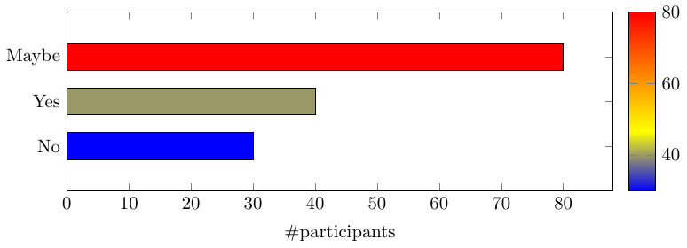
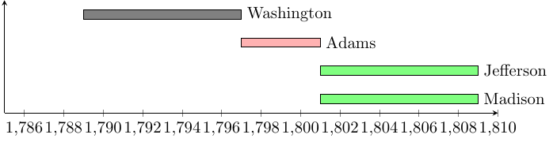
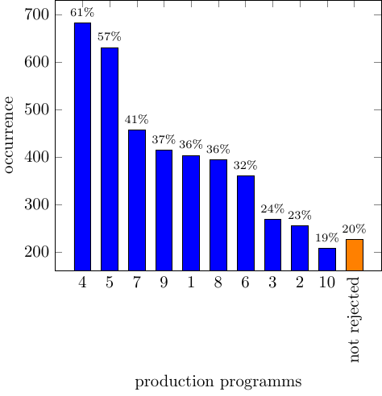

****

### [bar-horiz-5_points.tex](https://github.com/f0nzie/tikz_bars/blob/master/src/bar-horiz-5_points.tex)


  


`r a`
```{r}
# change pgf to tex
cat(readLines("./src/bar-horiz-5_points.tex"), sep = "\n")
```
`r b`
****

### [bar-interval.tex](https://github.com/f0nzie/tikz_bars/blob/master/src/bar-interval.tex)


  


`r a`
```{r}
# change pgf to tex
cat(readLines("./src/bar-interval.tex"), sep = "\n")
```
`r b`
****

### [bar-multicolor-grids.tex](https://github.com/f0nzie/tikz_bars/blob/master/src/bar-multicolor-grids.tex)


  


`r a`
```{r}
# change pgf to tex
cat(readLines("./src/bar-multicolor-grids.tex"), sep = "\n")
```
`r b`
****

### [bar-multicolor.tex](https://github.com/f0nzie/tikz_bars/blob/master/src/bar-multicolor.tex)


  


`r a`
```{r}
# change pgf to tex
cat(readLines("./src/bar-multicolor.tex"), sep = "\n")
```
`r b`
****

### [barchart.tex](https://github.com/f0nzie/tikz_bars/blob/master/src/barchart.tex)


  


`r a`
```{r}
# change pgf to tex
cat(readLines("./src/barchart.tex"), sep = "\n")
```
`r b`
****

### [bars-2-yes-no.tex](https://github.com/f0nzie/tikz_bars/blob/master/src/bars-2-yes-no.tex)


  


`r a`
```{r}
# change pgf to tex
cat(readLines("./src/bars-2-yes-no.tex"), sep = "\n")
```
`r b`
****

### [dynamic-axis-pgf.tex](https://github.com/f0nzie/tikz_bars/blob/master/src/dynamic-axis-pgf.tex)


  


`r a`
```{r}
# change pgf to tex
cat(readLines("./src/dynamic-axis-pgf.tex"), sep = "\n")
```
`r b`
****

### [dynamic-barchart-autocolor.tex](https://github.com/f0nzie/tikz_bars/blob/master/src/dynamic-barchart-autocolor.tex)



  


`r a`
```{r}
# change pgf to tex
cat(readLines("./src/dynamic-barchart-autocolor.tex"), sep = "\n")
```
`r b`
****

### [dynamic-barchart-color-from-table-pgf.tex](https://github.com/f0nzie/tikz_bars/blob/master/src/dynamic-barchart-color-from-table-pgf.tex)



  


`r a`
```{r}
# change pgf to tex
cat(readLines("./src/dynamic-barchart-color-from-table-pgf.tex"), sep = "\n")
```
`r b`
****

### [dynamic-barchart-discard-column-fm-table-4star-.tex](https://github.com/f0nzie/tikz_bars/blob/master/src/dynamic-barchart-discard-column-fm-table-4star-.tex)



  


`r a`
```{r}
# change pgf to tex
cat(readLines("./src/dynamic-barchart-discard-column-fm-table-4star-.tex"), sep = "\n")
```
`r b`
****

### [dynamic-barchart-discard-column-fm-table-9000-4star-.tex](https://github.com/f0nzie/tikz_bars/blob/master/src/dynamic-barchart-discard-column-fm-table-9000-4star-.tex)


  


`r a`
```{r}
# change pgf to tex
cat(readLines("./src/dynamic-barchart-discard-column-fm-table-9000-4star-.tex"), sep = "\n")
```
`r b`
