****

### [bar-horiz-5_points.tex](https://github.com/f0nzie/tikz_bars/blob/master/src/bar-horiz-5_points.tex)

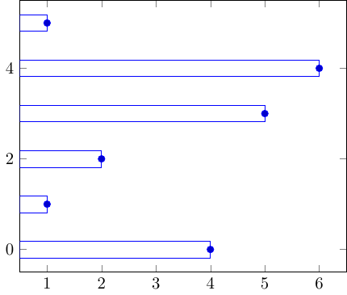

  


`r a`
```{r}
# change pgf to tex
cat(readLines("./src/bar-horiz-5_points.tex"), sep = "\n")
```
`r b`
****

### [bar-interval.tex](https://github.com/f0nzie/tikz_bars/blob/master/src/bar-interval.tex)

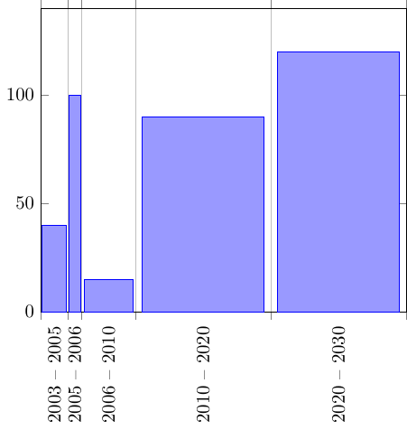

  


`r a`
```{r}
# change pgf to tex
cat(readLines("./src/bar-interval.tex"), sep = "\n")
```
`r b`
****

### [bar-multicolor-9000.tex](https://github.com/f0nzie/tikz_bars/blob/master/src/bar-multicolor-9000.tex)


  


`r a`
```{r}
# change pgf to tex
cat(readLines("./src/bar-multicolor-9000.tex"), sep = "\n")
```
`r b`
****

### [bar-multicolor-grids.tex](https://github.com/f0nzie/tikz_bars/blob/master/src/bar-multicolor-grids.tex)


  


`r a`
```{r}
# change pgf to tex
cat(readLines("./src/bar-multicolor-grids.tex"), sep = "\n")
```
`r b`
****

### [bar-multicolor-multiseries-center-figure-9000[4star].tex](https://github.com/f0nzie/tikz_bars/blob/master/src/bar-multicolor-multiseries-center-figure-9000[4star].tex)

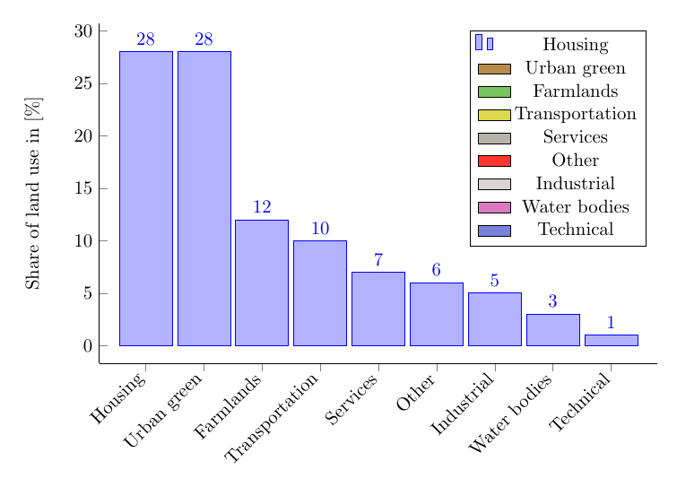

  


`r a`
```{r}
# change pgf to tex
cat(readLines("./src/bar-multicolor-multiseries-center-figure-9000[4star].tex"), sep = "\n")
```
`r b`
****

### [bar-multicolor-multiseries-center-figure.tex](https://github.com/f0nzie/tikz_bars/blob/master/src/bar-multicolor-multiseries-center-figure.tex)

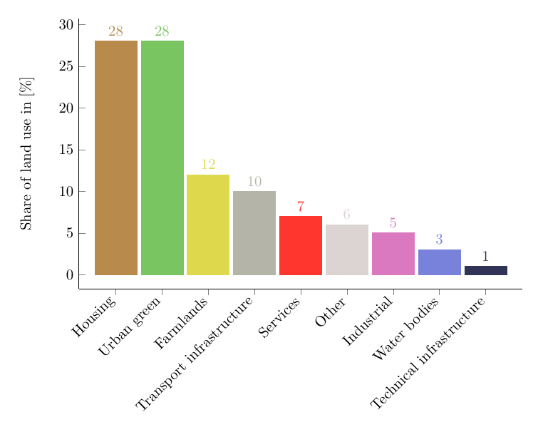

  


`r a`
```{r}
# change pgf to tex
cat(readLines("./src/bar-multicolor-multiseries-center-figure.tex"), sep = "\n")
```
`r b`
****

### [bar-multicolor-multiseries-center-figure[4star].tex](https://github.com/f0nzie/tikz_bars/blob/master/src/bar-multicolor-multiseries-center-figure[4star].tex)


  


`r a`
```{r}
# change pgf to tex
cat(readLines("./src/bar-multicolor-multiseries-center-figure[4star].tex"), sep = "\n")
```
`r b`
****

### [bar-multicolor-multiseries.tex](https://github.com/f0nzie/tikz_bars/blob/master/src/bar-multicolor-multiseries.tex)


  


`r a`
```{r}
# change pgf to tex
cat(readLines("./src/bar-multicolor-multiseries.tex"), sep = "\n")
```
`r b`
****

### [bar-multicolor.tex](https://github.com/f0nzie/tikz_bars/blob/master/src/bar-multicolor.tex)

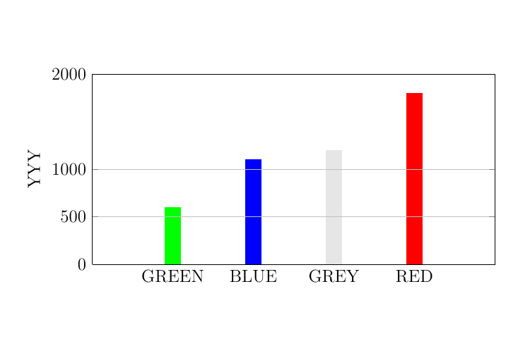

  


`r a`
```{r}
# change pgf to tex
cat(readLines("./src/bar-multicolor.tex"), sep = "\n")
```
`r b`
****

### [bar-percents-series-2.tex](https://github.com/f0nzie/tikz_bars/blob/master/src/bar-percents-series-2.tex)


  


`r a`
```{r}
# change pgf to tex
cat(readLines("./src/bar-percents-series-2.tex"), sep = "\n")
```
`r b`
****

### [barchart.tex](https://github.com/f0nzie/tikz_bars/blob/master/src/barchart.tex)


  


`r a`
```{r}
# change pgf to tex
cat(readLines("./src/barchart.tex"), sep = "\n")
```
`r b`
****

### [bars_2-series.tex](https://github.com/f0nzie/tikz_bars/blob/master/src/bars_2-series.tex)


  


`r a`
```{r}
# change pgf to tex
cat(readLines("./src/bars_2-series.tex"), sep = "\n")
```
`r b`
****

### [bars-2-yes-no.tex](https://github.com/f0nzie/tikz_bars/blob/master/src/bars-2-yes-no.tex)


  


`r a`
```{r}
# change pgf to tex
cat(readLines("./src/bars-2-yes-no.tex"), sep = "\n")
```
`r b`
****

### [custom_labels.tex](https://github.com/f0nzie/tikz_bars/blob/master/src/custom_labels.tex)


  


`r a`
```{r}
# change pgf to tex
cat(readLines("./src/custom_labels.tex"), sep = "\n")
```
`r b`
****

### [dynamic-axis-pgf.tex](https://github.com/f0nzie/tikz_bars/blob/master/src/dynamic-axis-pgf.tex)

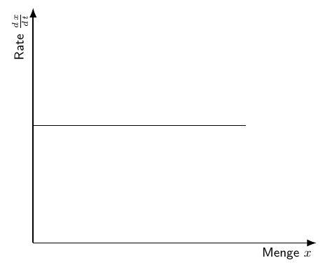

  


`r a`
```{r}
# change pgf to tex
cat(readLines("./src/dynamic-axis-pgf.tex"), sep = "\n")
```
`r b`
****

### [dynamic-barchart-autocolor.tex](https://github.com/f0nzie/tikz_bars/blob/master/src/dynamic-barchart-autocolor.tex)


  


`r a`
```{r}
# change pgf to tex
cat(readLines("./src/dynamic-barchart-autocolor.tex"), sep = "\n")
```
`r b`
****

### [dynamic-barchart-color-from-table-pgf.tex](https://github.com/f0nzie/tikz_bars/blob/master/src/dynamic-barchart-color-from-table-pgf.tex)


  


`r a`
```{r}
# change pgf to tex
cat(readLines("./src/dynamic-barchart-color-from-table-pgf.tex"), sep = "\n")
```
`r b`
****

### [dynamic-barchart-discard-column-fm-table-4star-.tex](https://github.com/f0nzie/tikz_bars/blob/master/src/dynamic-barchart-discard-column-fm-table-4star-.tex)


  


`r a`
```{r}
# change pgf to tex
cat(readLines("./src/dynamic-barchart-discard-column-fm-table-4star-.tex"), sep = "\n")
```
`r b`
****

### [dynamic-barchart-discard-column-fm-table-9000-4star-.tex](https://github.com/f0nzie/tikz_bars/blob/master/src/dynamic-barchart-discard-column-fm-table-9000-4star-.tex)

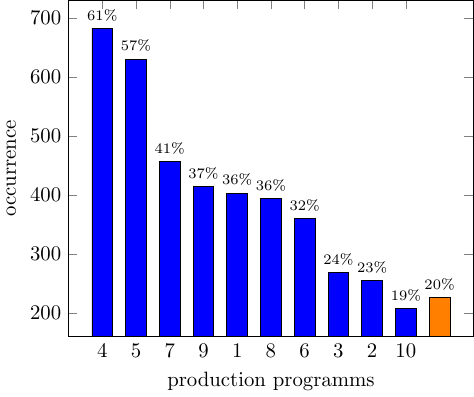

  


`r a`
```{r}
# change pgf to tex
cat(readLines("./src/dynamic-barchart-discard-column-fm-table-9000-4star-.tex"), sep = "\n")
```
`r b`
****

### [dynamic-barchart-extract-color-fm-table-data-9000[5star].tex](https://github.com/f0nzie/tikz_bars/blob/master/src/dynamic-barchart-extract-color-fm-table-data-9000[5star].tex)

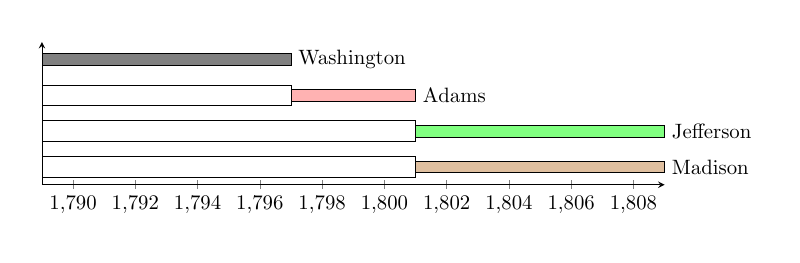

  


`r a`
```{r}
# change pgf to tex
cat(readLines("./src/dynamic-barchart-extract-color-fm-table-data-9000[5star].tex"), sep = "\n")
```
`r b`
****

### [dynamic-barchart-extract-color-fm-table-data.tex](https://github.com/f0nzie/tikz_bars/blob/master/src/dynamic-barchart-extract-color-fm-table-data.tex)

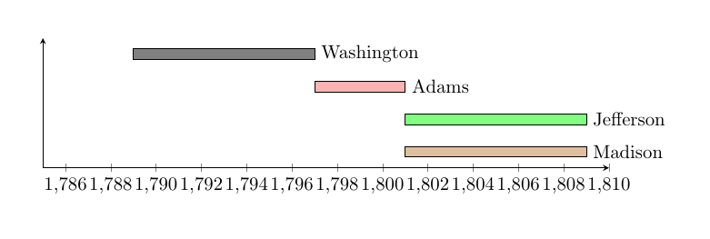

  


`r a`
```{r}
# change pgf to tex
cat(readLines("./src/dynamic-barchart-extract-color-fm-table-data.tex"), sep = "\n")
```
`r b`
****

### [dynamic-barchart-from-table-pgf-9000.tex](https://github.com/f0nzie/tikz_bars/blob/master/src/dynamic-barchart-from-table-pgf-9000.tex)

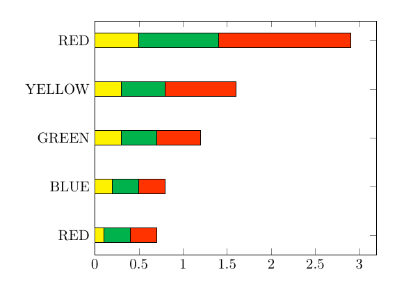

  


`r a`
```{r}
# change pgf to tex
cat(readLines("./src/dynamic-barchart-from-table-pgf-9000.tex"), sep = "\n")
```
`r b`
****

### [dynamic-barchart-from-table-pgf.tex](https://github.com/f0nzie/tikz_bars/blob/master/src/dynamic-barchart-from-table-pgf.tex)

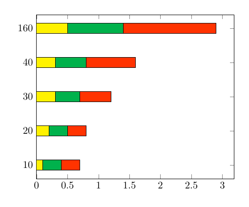

  


`r a`
```{r}
# change pgf to tex
cat(readLines("./src/dynamic-barchart-from-table-pgf.tex"), sep = "\n")
```
`r b`
****

### [dynamic-barchart-pgfplotsinvokeforeach-multicolor-9000[4star].tex](https://github.com/f0nzie/tikz_bars/blob/master/src/dynamic-barchart-pgfplotsinvokeforeach-multicolor-9000[4star].tex)

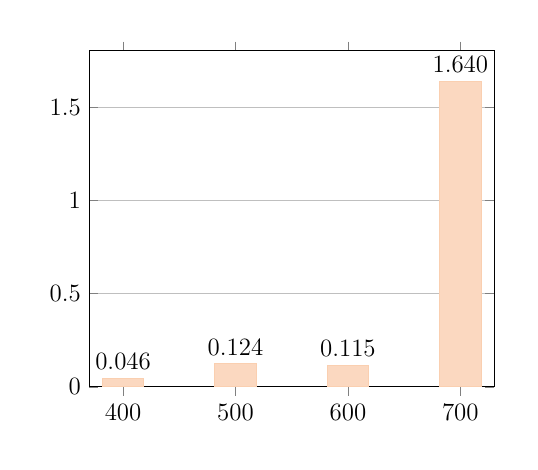

  


`r a`
```{r}
# change pgf to tex
cat(readLines("./src/dynamic-barchart-pgfplotsinvokeforeach-multicolor-9000[4star].tex"), sep = "\n")
```
`r b`
****

### [dynamic-barchart-pgfplotsinvokeforeach-multicolor[4star].tex](https://github.com/f0nzie/tikz_bars/blob/master/src/dynamic-barchart-pgfplotsinvokeforeach-multicolor[4star].tex)

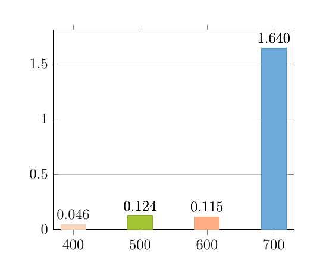

  


`r a`
```{r}
# change pgf to tex
cat(readLines("./src/dynamic-barchart-pgfplotsinvokeforeach-multicolor[4star].tex"), sep = "\n")
```
`r b`
****

### [dynamic-barchart-read-xticklabels-fm-table-[4star].tex](https://github.com/f0nzie/tikz_bars/blob/master/src/dynamic-barchart-read-xticklabels-fm-table-[4star].tex)

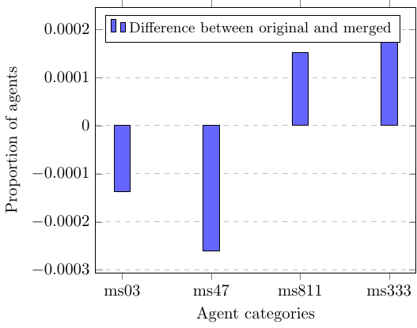

  


`r a`
```{r}
# change pgf to tex
cat(readLines("./src/dynamic-barchart-read-xticklabels-fm-table-[4star].tex"), sep = "\n")
```
`r b`
****

### [dynamic-barchart-read-xticklabels-fm-table-resume-[4star].tex](https://github.com/f0nzie/tikz_bars/blob/master/src/dynamic-barchart-read-xticklabels-fm-table-resume-[4star].tex)


  


`r a`
```{r}
# change pgf to tex
cat(readLines("./src/dynamic-barchart-read-xticklabels-fm-table-resume-[4star].tex"), sep = "\n")
```
`r b`
****

### [dynamic-barchart-transposing-table-[5star].tex](https://github.com/f0nzie/tikz_bars/blob/master/src/dynamic-barchart-transposing-table-[5star].tex)

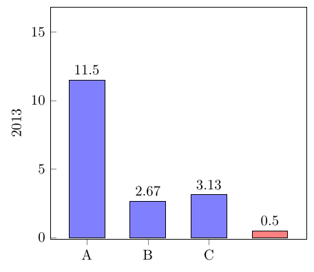

  


`r a`
```{r}
# change pgf to tex
cat(readLines("./src/dynamic-barchart-transposing-table-[5star].tex"), sep = "\n")
```
`r b`
****

### [dynamic-barchart-transposing-table-9000-[5star].tex](https://github.com/f0nzie/tikz_bars/blob/master/src/dynamic-barchart-transposing-table-9000-[5star].tex)

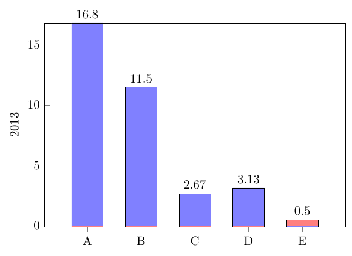

  


`r a`
```{r}
# change pgf to tex
cat(readLines("./src/dynamic-barchart-transposing-table-9000-[5star].tex"), sep = "\n")
```
`r b`
****

### [dynamic-barchart-transposing-table-resume-[5star].tex](https://github.com/f0nzie/tikz_bars/blob/master/src/dynamic-barchart-transposing-table-resume-[5star].tex)

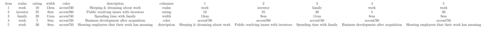

  


`r a`
```{r}
# change pgf to tex
cat(readLines("./src/dynamic-barchart-transposing-table-resume-[5star].tex"), sep = "\n")
```
`r b`
****

### [dynamic-barchart-xticks-fm-data.tex](https://github.com/f0nzie/tikz_bars/blob/master/src/dynamic-barchart-xticks-fm-data.tex)

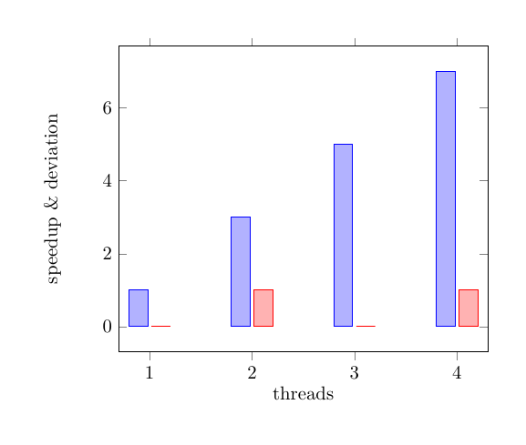

  


`r a`
```{r}
# change pgf to tex
cat(readLines("./src/dynamic-barchart-xticks-fm-data.tex"), sep = "\n")
```
`r b`
****

### [dynamic-linechart-read-from-table-pgf.tex](https://github.com/f0nzie/tikz_bars/blob/master/src/dynamic-linechart-read-from-table-pgf.tex)

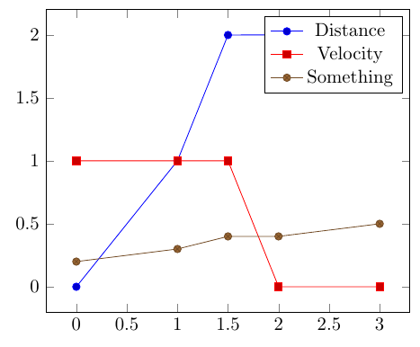

  


`r a`
```{r}
# change pgf to tex
cat(readLines("./src/dynamic-linechart-read-from-table-pgf.tex"), sep = "\n")
```
`r b`
****

### [stacked_bar_with_text.tex](https://github.com/f0nzie/tikz_bars/blob/master/src/stacked_bar_with_text.tex)

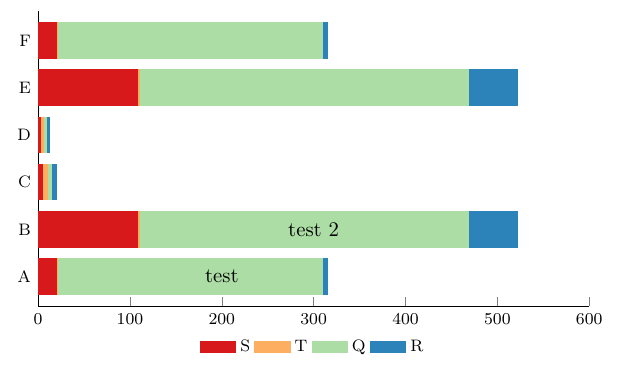

  


`r a`
```{r}
# change pgf to tex
cat(readLines("./src/stacked_bar_with_text.tex"), sep = "\n")
```
`r b`
****

### [table-text.tex](https://github.com/f0nzie/tikz_bars/blob/master/src/table-text.tex)

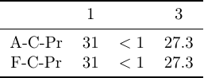

  


`r a`
```{r}
# change pgf to tex
cat(readLines("./src/table-text.tex"), sep = "\n")
```
`r b`
