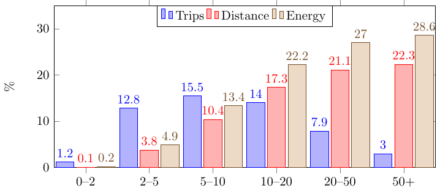

****

### [bar-horiz-5_points.tex](https://github.com/f0nzie/tikz_bars/blob/master/src/bar-horiz-5_points.tex)


  


`r a`
```{r}
# change pgf to tex
cat(readLines("./src/bar-horiz-5_points.tex"), sep = "\n")
```
`r b`
****

### [bar-multicolor.tex](https://github.com/f0nzie/tikz_bars/blob/master/src/bar-multicolor.tex)


  


`r a`
```{r}
# change pgf to tex
cat(readLines("./src/bar-multicolor.tex"), sep = "\n")
```
`r b`
****

### [barchart.tex](https://github.com/f0nzie/tikz_bars/blob/master/src/barchart.tex)



  


`r a`
```{r}
# change pgf to tex
cat(readLines("./src/barchart.tex"), sep = "\n")
```
`r b`
